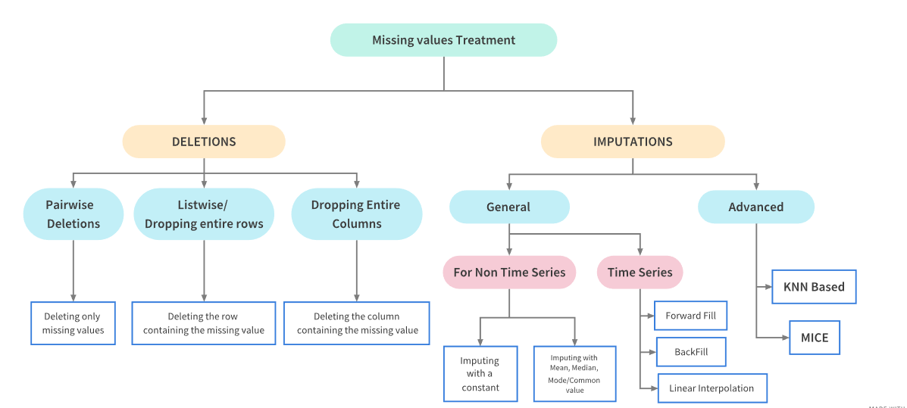
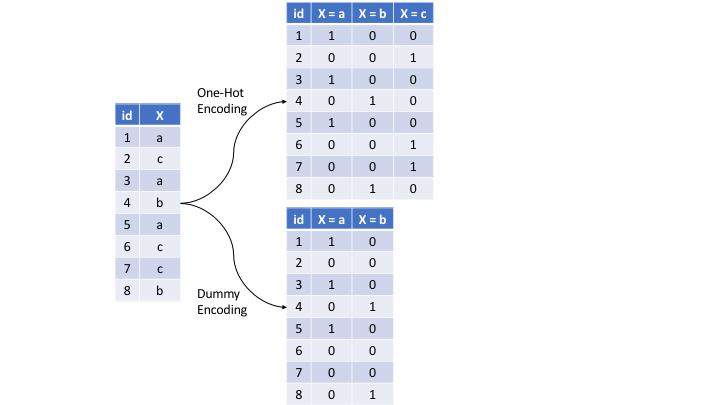
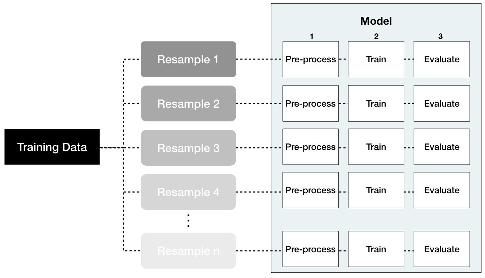

# Feature & Target Engineering

**Learning objectives:**

-   Target engineering

-   Dealing with missing values

-   Feature filtering

-   Numeric feature engineering

-   Categorical feature engineering

-   Dimension reduction

-   Proper implementation

```{r setup_3, echo = FALSE, warning = FALSE, message = FALSE}
suppressMessages(library(tidyverse))
library(visdat)
library(caret)
library(recipes)
library(kableExtra)
theme_set(theme_light())
```

## Introduction {.unnumbered}

`Applied machine learning is basically feature engineering` - Prof. Andrew Ng

Feature engineering is the process of **selecting, extracting, and transforming** relevant features from raw data to create a more informative and suitable input for machine learning algorithms. Also, it involves identifying the most important characteristics of the data and representing them in a way that is compatible with machine learning model input scheme (source: ChatGPT).

## 3.2 Target engineering {.unnumbered}

Transforming the response (target) variable can lead to predictive improvement, especially with *parametric* models (i.e., models with certain assumptions about the underlying distribution of response and predictor variables). Let's use the `AMES` housing dataset to illustrate this concept.

```{r engineering-ames-train, echo = FALSE}
ames <- AmesHousing::make_ames()

# relocate `Sale_Price`
ames <- ames %>% 
     relocate(Sale_Price, .before = everything())

# Load and split the Ames housing data using stratified sampling
set.seed(123)  # for reproducibility
split  <- rsample::initial_split(ames, prop = 0.7, strata = "Sale_Price")
ames_train  <- rsample::training(split)
ames_test   <- rsample::testing(split)
```

First look at train dataset.

```{r first-look-dataset}
ames_train %>% 
     select(1:10) %>% 
     glimpse()
```

Plot the histogram response variable (Sales_Price)

```{r sale-price-histogram}
ames_train %>% 
     ggplot(aes(Sale_Price)) + 
     geom_histogram(fill = 'steelblue')
```

```{r skewness}
library(moments)

skewness(ames_train$Sale_Price)
```

`Sale_Price` has a right skeweness. This means that the majority of the distribution values are left of the distribution mean.

Solution #1 - Normalize with a log transformation

```{r log-transformation}
ames_train %>% 
     mutate(log_Sale_Price = log(Sale_Price)) %>% 
     ggplot(aes(log_Sale_Price)) + 
     geom_histogram(fill = 'steelblue')

skewness(log(ames_train$Sale_Price))
```

Solution #2 - Apply Box-Cox transformation

```{r box-cox}
lambda  <- forecast::BoxCox.lambda(ames_train$Sale_Price)
ames_train %>% 
     mutate(bc_Sale_Price = forecast::BoxCox(ames_train$Sale_Price, lambda)) %>% 
     ggplot(aes(bc_Sale_Price)) + 
     geom_histogram(fill = 'steelblue')

skewness(forecast::BoxCox(ames_train$Sale_Price, lambda))
```

Comments from the textbook:

-   Be sure to compute the `lambda` on the training set and apply that same `lambda` to both the training and test set to minimize data leakage. The **recipes** package automates this process for you.

-   If your response has negative values, the Yeo-Johnson transformation is very similar to the Box-Cox but does not require the input variables to be strictly positive. To apply, use `step_YeoJohnson()`.

## 3.3 Dealing with missingness {.unnumbered}

Diagnose `AMES` housing dataset missing values

```{r engineering-ames-raw-missing}
ames_raw <- AmesHousing::ames_raw

sum(is.na(ames_raw))
```

```{r skim-dataset, fig.width = 10}
library(skimr)

# custom skim function to remove some of the quartile data
my_skim <- skim_with(numeric = sfl(p25 = NULL, p75 = NULL))

my_skim(ames_raw) %>% 
     filter(n_missing > 0)
```

Visualize missing values

```{r vis-miss}
vis_miss(ames_raw, sort_miss = TRUE)
```

Another way to visualize missing values

```{r data-explorer-missing-values}
library(DataExplorer)

ames_raw %>% 
     plot_missing(missing_only = TRUE)
```

What is the cause for missing values?

-   Error in data entry

-   Values were never recorded

-   Respondent didn't provide a numeric/categorical input (common in surveys)

## Missing values treatment

{heigth="800px," width="1000px"}

Before we start deleting or imputing missing data, it is advisable to investigate the meaning or cause of the missing values. In the AMES housing data, the creators provide extensive documentation explaining in most cases why variables have missing values.

For example, the variable `Garage Type` missing values identify housing units without garages. The textbook confirms this insight comparing `Garage Type` with `Garage Cars` (size of garage in car capacity) and `Garage Area` (garage total area in square feet).

```{r garage-type}
ames_raw %>% 
     filter(is.na(`Garage Type`)) %>% 
     select(`Garage Type`, `Garage Cars`, `Garage Area`)
```

The logical conclusion is that we can impute `Garage Type` missing values with a label 'none' or 'no garage'.

## Imputation {.unnumbered}

*Imputation* is the process of replacing a missing value with a substituted, "best guess" value. Imputation should be one of the first feature engineering steps you take as it will affect any downstream preprocessing.

-   Estimated statistic (mean, median, mode) \<-- **avoid this method!**

-   KNN

-   Tree-based

-   MICE (not available in tidymodels recipes)

## 3.4 Feature filtering {.unnumbered}

Zero and near-zero variance variables are low-hanging fruit to eliminate.

-   Zero variance - feature only contains a single unique value (no predictive power)

-   Near zero variance - feature with near zero variance offer very little, if any, information to a model.

```{r caret-nzv}
caret::nearZeroVar(ames_train, saveMetrics = TRUE) %>% 
     tibble::rownames_to_column() %>% 
     filter(nzv)
```

Other feature filtering methods exists. For example:

-   Filter methods (ex. zv, nzv, correlation)

-   Wrapper methods (ex. forward selection, backward elimination, RFE)

-   Embedded methods (ex. Lasso - L1, Ridge - L2)

Source: <https://www.analyticsvidhya.com/blog/2016/12/introduction-to-feature-selection-methods-with-an-example-or-how-to-select-the-right-variables/>

## 3.5 Numeric feature engineering {.unnumbered}

Numeric features can create a host of problems for certain models when their distributions are skewed, contain outliers, or have a wide range in magnitudes.

Tree-based models are quite immune to these types of problems in the feature space, but many other models (e.g., GLMs, regularized regression, KNN, support vector machines, neural networks) can be greatly hampered by these issues.

Normalizing and standardizing heavily skewed features can help minimize these concerns.

-   *Skewness*

Similar to the process discussed to normalize target variables, parametric models that have distributional assumptions (e.g., GLMs, and regularized models) can benefit from minimizing the skewness of numeric features.

-   *Standardization*

We must also consider the *scale* on which the individual features are measured. What are the largest and smallest values across all features and do they span several orders of magnitude? Models that incorporate smooth functions of input features are sensitive to the scale of the inputs.

```{r standardization}
set.seed(123)
x1 <- tibble(
  variable = "x1",
  `Real value` = runif(25, min = -30, max = 5),
  `Standardized value` = scale(`Real value`) %>% as.numeric()
)

set.seed(456)
x2 <- tibble(
  variable = "x2",
  `Real value` = rlnorm(25, log(25)),
  `Standardized value` = scale(`Real value`) %>% as.numeric()
)

set.seed(789)
x3 <- tibble(
  variable = "x3",
  `Real value` = rnorm(25, 150, 15),
  `Standardized value` = scale(`Real value`) %>% as.numeric()
)

x1 %>%
  bind_rows(x2) %>%
  bind_rows(x3) %>%
  gather(key, value, -variable) %>%
  mutate(variable = factor(variable, levels = c("x3", "x2", "x1"))) %>%
  ggplot(aes(value, variable)) +
    geom_point(alpha = .6) +
    facet_wrap(~ key, scales = "free_x") +
    ylab("Feature") +
    xlab("Value")
```

## 3.6 Categorical feature engineering {.unnumbered}

Most models require that the predictors take numeric form. There are exceptions; for example, tree-based models naturally handle numeric or categorical features. However, even tree-based models can benefit from preprocessing categorical features.

-   Lumping

Sometimes features will contain levels that have very few observations. For example, there are 28 unique neighborhoods represented in the Ames housing data but several of them only have a few observations.

```{r neighborhood-lumping}
ames_train %>% 
     count(Neighborhood) %>% 
     arrange(n)
```

Lump levels with `step_other` - categorical

```{r step-other}
lump_rec <- recipe(Sale_Price ~ ., data = ames_train) %>% 
     step_other(Neighborhood, threshold = 0.01, 
                other = "other")

lump_rec %>% 
     prep() %>% 
     bake(new_data = ames_train) %>%
     count(Neighborhood) %>% 
     arrange(n)
```

Lump levels `step_mutate` - numerical

```{r screen-porch}
ames_train %>% 
     count(Screen_Porch) %>% 
     arrange(-n)
```

```{r screen-porch-flag}
lump_screen_porch_rec <- recipe(Sale_Price ~ ., data = ames_train) %>% 
     step_mutate(Screen_Porch_flag = ifelse(Screen_Porch == 0, '0', '>0')) %>% 
     step_string2factor(Screen_Porch_flag)

lump_screen_porch_rec %>% 
     prep() %>% 
     bake(new_data = ames_train) %>%
     count(Screen_Porch_flag) %>% 
     arrange(n)
```

Comment: `step_normalize` combines both `step_center` and `step_scale`.

## One-hot & dummy encoding {.unnumbered}

Many models require that all predictor variables be numeric. Consequently, we need to intelligently transform any categorical variables into numeric representations so that these algorithms can compute. Some packages automate this process (e.g., **h2o** and **caret**) while others do not (e.g., glmnet and keras). There are many ways to recode categorical variables as numeric (e.g., one-hot, ordinal, binary, sum, and Helmert).

The most common is referred to as one-hot encoding, where we transpose our categorical variables so that each level of the feature is represented as a boolean value.

{heigth="800px," width="1000px"}

We can one-hot or dummy encode with the same function (`step_dummy()`). By default, `step_dummy()` will create a full rank encoding but you can change this by setting `one_hot = TRUE`.

Comment: Since one-hot encoding adds new features it can significantly increase the dimensionality of our data.

-   Label encoding

*Label encoding* is a pure numeric conversion of the levels of a categorical variable. If a categorical variable is a factor and it has pre-specified levels then the numeric conversion will be in level order. If no levels are specified, the encoding will be based on alphabetical order.

```{r ms_subclass}
ames_train %>% 
     count(MS_SubClass)

# Label encoded
recipe(Sale_Price ~ ., data = ames_train) %>%
     step_integer(MS_SubClass) %>%
     prep(ames_train) %>%
     bake(ames_train) %>%
     count(MS_SubClass)
```

We should be careful with label encoding unordered categorical features because most models will treat them as ordered numeric features. If a categorical feature is naturally ordered then label encoding is a natural choice (most commonly referred to as ordinal encoding). For example, the various quality features in the Ames housing data are ordinal in nature (ranging from `Very_Poor` to `Very_Excellent`).

```{r qual_features}
ames_train %>% 
     select(contains('Qual'))
```

Ordinal encoding these features provides a natural and intuitive interpretation and can logically be applied to all models.

```{r ordinal-categorical}
ames_train %>% 
     count(Overall_Qual)

# Label encoded
recipe(Sale_Price ~ ., data = ames_train) %>%
     step_integer(Overall_Qual) %>%
     prep(ames_train) %>%
     bake(ames_train) %>%
     count(Overall_Qual)
```

## Alternatives {.unnumbered}

There are several alternative categorical encodings that are implemented in various R machine learning engines and are worth exploring. For example, target encoding is the process of replacing a categorical value with the mean (regression) or proportion (classification) of the target variable. For example, target encoding the `Neighborhood` feature would change `North_Ames` to 143517.

```{r target-encoding}
ames_train %>%
     group_by(Neighborhood) %>%
     summarize(`Avg Sale_Price` = mean(Sale_Price, na.rm = TRUE)) %>%
     head(10) %>%
     kable(caption = "Example of target encoding the Neighborhood feature of the Ames housing data set.") %>%
     kable_styling(bootstrap_options = "striped", full_width = TRUE)
```

Target encoding runs the risk of `data leakage` since you are using the response variable to encode a feature. An alternative is to change the feature value to represent the proportion a particular level represents for a given feature. In this case, North_Ames would be changed to 0.149.

```{r proportion-encoding}
ames_train %>%
  count(Neighborhood) %>%
  mutate(Proportion = n / sum(n)) %>%
  select(-n) %>%
  head(10) %>%
  kable(caption = 'Example of categorical proportion encoding the Neighborhood feature of the Ames housing data set.') %>%
  kable_styling(bootstrap_options = "striped", full_width = TRUE)
```

For other alternatives to categorical encoding, refer to `embed` package (<https://embed.tidymodels.org/>)

## 3.7 Dimension reduction {.unnumbered}

Dimension reduction is an alternative approach to filter out non-informative features without manually removing them. We discuss dimension reduction topics in depth later in the book (Chapters 17-19) so please refer to those chapters for details.

For example, we may wish to reduce the dimension of our features with principal components analysis (Chapter 17) and retain the number of components required to explain, say, 95% of the variance and use these components as features in downstream modeling.

## 3.8 Proper implementation {.unnumbered}

We stated at the beginning of this chapter that we should think of feature engineering as creating a blueprint rather than manually performing each task individually. This helps us in two ways: (1) thinking sequentially and (2) to apply appropriately within the resampling process.

While your project's needs may vary, here is a suggested order of potential steps that should work for most problems:

1.  Filter out zero or near-zero variance features.

2.  Perform imputation if required.

3.  Normalize to resolve numeric feature skewness.

4.  Standardize (center and scale) numeric features.

5.  Perform dimension reduction (e.g., PCA) on numeric features.

6.  One-hot or dummy encode categorical features.

Also, refer to tidymodels recipes - ordering of steps (<https://recipes.tidymodels.org/articles/Ordering.html>)

## Data leakage {.unnumbered}

*Data leakage* is when information from outside the training data set is used to create the model. Data leakage often occurs during the data preprocessing period.

{heigth="800px," width="1000px"}

## Putting the pieces together {.unnumbered}

The first step is where you define your blueprint (aka recipe). With this process, you supply the formula of interest (the target variable, features, and the data these are based on) with `recipe()` and then you sequentially add feature engineering steps with `step_xxx()`.

 1. Remove near-zero variance features that are categorical (aka nominal).
 
 2. Ordinal encode our quality-based features (which are inherently ordinal).
 
 3. Center and scale (i.e., standardize) all numeric features.
 
 4. One-hot encode our remaining categorical features.

```{r blueprint}
blueprint <- recipe(Sale_Price ~ ., data = ames_train) %>% 
     step_nzv(all_nominal()) %>% 
     step_integer(matches("Qual|Cond|QC|Qu")) %>% 
     step_normalize(all_numeric(), -all_outcomes()) %>% 
     step_dummy(all_nominal(), -all_outcomes(), one_hot = TRUE)

blueprint
```

Next, we need to train this blueprint on some training data. Remember, there are many feature engineering steps that we do not want to train on the test data (e.g., standardize and PCA) as this would create data leakage. So in this step we estimate these parameters based on the training data of interest.

Lastly, we can apply our blueprint to new data (e.g., the training data or future test data) with `bake()`.

```{r blueprint_prep_bake}
blueprint %>% 
     prep() %>% 
     bake(new_data = ames_train) %>% 
     glimpse()
```

Next, we apply the same resampling method and hyperparameter search grid as we did in Section 2.7. The only difference is when we train our resample models with `train()`, we supply our blueprint as the first argument and then caret takes care of the rest.

```{r blueprint-knn}
# Specify resampling plan
cv <- trainControl(
  method = "repeatedcv", 
  number = 10, 
  repeats = 5
)

# Construct grid of hyperparameter values
hyper_grid <- expand.grid(k = seq(2, 25, by = 1))

# Tune a knn model using grid search
knn_fit2 <- train(
  blueprint, 
  data = ames_train, 
  method = "knn", 
  trControl = cv, 
  tuneGrid = hyper_grid,
  metric = "RMSE"
)
```

```{r blueprint-knn-assess}
# print model results
knn_fit2

# plot cross validation results
ggplot(knn_fit2)
```

Looking at our results we see that the best model was associated with `k` = 10, which resulted in a cross-validated RMSE of 33,400.

## Meeting Videos {.unnumbered}

### Cohort 1 {.unnumbered}

`r knitr::include_url("https://www.youtube.com/embed/URL")`

<details>

<summary>Meeting chat log</summary>

```         
LOG
```

</details>
