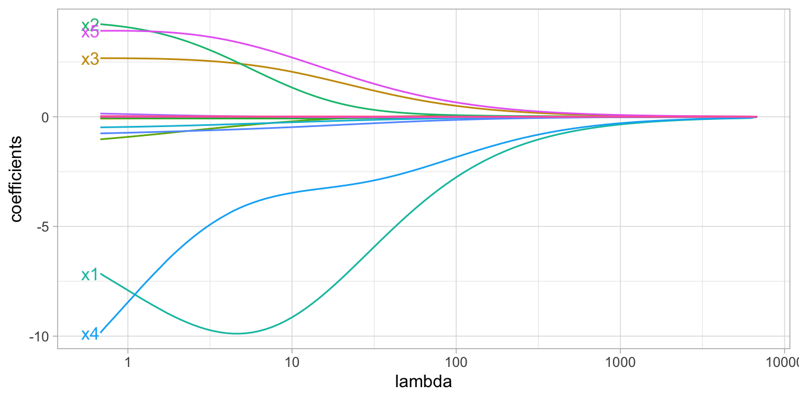
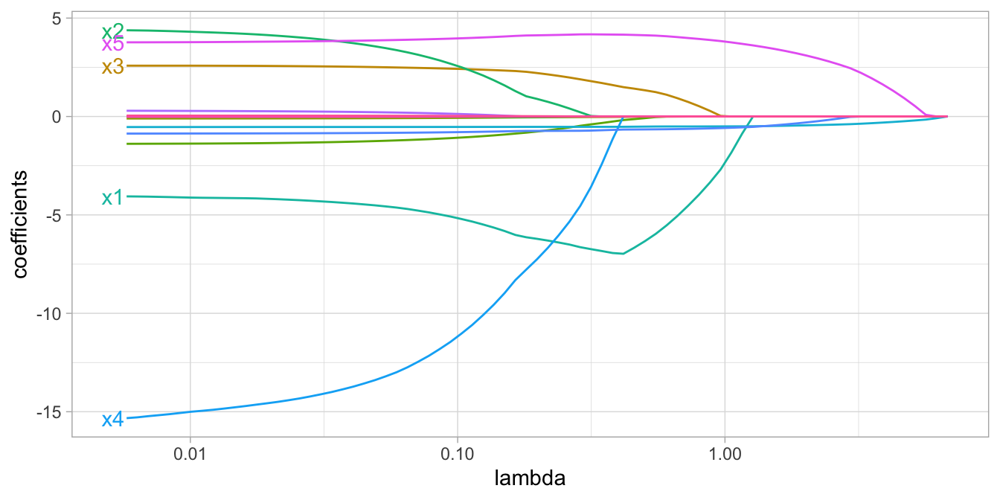

# Regularized Regression

**Learning objectives:**

-   Why regularize?

-   Regularization (penalty models)

-   Implementation

-   Tuning

-   Feature interpretation

-   Attrition data

-   Final thoughts

```{r setup_6, echo = FALSE, warning = FALSE, message = FALSE}
# suppressMessages(library(tidyverse))
# library(recipes)
library(rsample)
library(glmnet)
# library(caret)
library(vip)
# theme_set(theme_light())
```

## Introduction {.unnumbered}

-   Linear models (LMs) provide a simple, yet effective, approach to predictive modeling.

-   However, in today's world, data sets being analyzed typically contain a large number of features.

-   As the number of features grow, certain assumptions typically break down and these models tend to overfit the training data, causing our out of sample error to increase.

-   **Regularization** methods provide a means to constrain or *regularize* the estimated coefficients, which can reduce the variance and decrease out of sample error.

## 6.1 - Why regularize? {.unnumbered}

```{r AmesHousing}
ames <- AmesHousing::make_ames()

# Stratified sampling with the rsample package
set.seed(123)  # for reproducibility
split  <- initial_split(ames, prop = 0.7, strata = "Sale_Price")
ames_train  <- training(split)
ames_test   <- testing(split)
```

Create an OLS model with `Sale_Price` \~ `Gr_Liv_Area`

```{r OLS}
ames_sub <- ames_train %>%
     filter(Gr_Liv_Area > 1000 & Gr_Liv_Area < 3000) %>%
     sample_frac(0.5)

model1 <- lm(Sale_Price ~ Gr_Liv_Area, data = ames_sub)

model1 %>%
     broom::augment() %>%
     ggplot(aes(Gr_Liv_Area, Sale_Price)) + 
     geom_segment(aes(x = Gr_Liv_Area, y = Sale_Price,
                      xend = Gr_Liv_Area, yend = .fitted), 
                  alpha = 0.3) +
     geom_point(size = 1, color = "red") +
     geom_smooth(se = FALSE, method = "lm") +
     scale_y_continuous(labels = scales::dollar)
```

The objective function being minimized can be written as:

```{=tex}
\begin{equation}
\operatorname{minimize}\left(S S E=\sum_{i=1}^n\left(y_i-\hat{y}_i\right)^2\right)
\end{equation}
```

-   For more complex datasets, OLS assumptions can be violated, such as the number of predictors ($p$) greater than the number of observations ($n$). Also, the presence of multicollinearity increases with the addition of predictors.

-   A solution to the above scenario is the use of *penalized models* or *shrinkage* methods to constrain the total size of all the coefficient estimates.

-   This constraint helps to reduce the magnitude and fluctuations of the coefficients and will reduce the variance of our model (at the expense of no longer being unbiased (a reasonable compromise).

-   The objective function of a regularized regression model is similar to OLS, albeit with a penalty term $P$.

```{=tex}
\begin{equation}
\operatorname{minimize}(S S E + P)
\end{equation}
```
There are three common penalty parameters we can implement:

-   Ridge;

-   Lasso;

-   ElasticNet, which is a combination of ridge and lasso

## 6.2.1 - Ridge penalty {.unnumbered}

Ridge (L2) regression controls the estimated coefficients by adding a penalty to the objective function:

```{=tex}
\begin{equation}
\operatorname{minimize}\left(S S E+\lambda \sum_{j=1}^p \beta_j^2\right)
\end{equation}
```
-   When $\lambda$ = 0, there is no effect and the objective function is equal to the OLS regression.

-   However, as $\lambda$ -\> $\infty$, the penalty becomes large and forces the coefficients toward zero (but not all the way).

{heigth="800px," width="1000px"}

-   Ridge regression does **not** perform feature selection and will retain **all** available features.

## 6.2.2 - Lasso penalty {.unnumbered}

The lasso (least absolute shrinkage and selection operator) penalty is an alternative to the ridge penalty that requires only a small modification. The objective function is:

```{=tex}
\begin{equation}
\operatorname{minimize}\left(S S E+\lambda \sum_{j=1}^p |\beta_j|\right)
\end{equation}
```
Whereas the ridge penalty pushes variables to approximately but not equal to zero, the lasso penalty will actually push coefficients all the way to zero as illustrated in Figure 6.3.

{heigth="800px," width="1000px"}

In the figure above we see that when λ\<0.01 all 15 variables are included in the model, when λ≈0.5 9 variables are retained, and when log(λ)=1 only 5 variables are retained.

## 6.2.3 - Elastic nets {.unnumbered}

A generalization of the ridge and lasso penalties, called the elastic net, combines the two penalties.

The advantage of the elastic net penalty is that it enables effective regularization via the ridge penalty with the feature selection characteristics of the lasso penalty.

## 6.3 - Implementation {.unnumbered}

We'll us the `glmnet` package for the regularized regression models.

```{r regularized-regression-data-prep}
# Create training  feature matrices
# we use model.matrix(...)[, -1] to discard the intercept
X <- model.matrix(Sale_Price ~ ., ames_train)[, -1]

# transform y with log transformation
Y <- log(ames_train$Sale_Price)
```

To apply a regularized model we can use the `glmnet::glmnet()` function. The alpha parameter tells glmnet to perform a ridge (`alpha = 0`), lasso (`alpha = 1`), or elastic net (`0 < alpha < 1`) model.

```{r ridge1}
ridge <- glmnet(
  x = X,
  y = Y,
  alpha = 0
)

plot(ridge, xvar = "lambda")
```

```{r ridge1-results}
# lambdas applied to penalty parameter
ridge$lambda %>% head()

ridge$lambda %>% tail()

# small lambda results in large coefficients
coef(ridge)[c("Latitude", "Overall_QualVery_Excellent"), 100]

# large lambda results in small coefficients
coef(ridge)[c("Latitude", "Overall_QualVery_Excellent"), 1]
```

At this point, we do not understand how much improvement we are experiencing in our loss function across various λ values.

## 6.4 - Tuning {.unnumbered}

Recall that λ is a tuning parameter that helps to control our model from over-fitting to the training data.

We use k-fold CV to identify the optimal λ.

```{r cv-tuning}
# Apply CV ridge regression to Ames data
ridge <- cv.glmnet(
  x = X,
  y = Y,
  alpha = 0
)

# Apply CV lasso regression to Ames data
lasso <- cv.glmnet(
  x = X,
  y = Y,
  alpha = 1
)

# plot results
par(mfrow = c(1, 2))
plot(ridge, main = "Ridge penalty\n\n")
plot(lasso, main = "Lasso penalty\n\n")
```

Ridge regression does not force any variables to exactly zero so all features will remain in the model but we see the number of variables retained in the lasso model decrease as the penalty increases.

The first and second vertical dashed lines represent the λ value with the minimum MSE and the largest λ value within one standard error of it. The minimum MSE for our ridge model is 0.02194817 (produced when λ= 0.1389619), whereas the minimum MSE for our lasso model is 0.0220374 (produced when λ= 0.00328574).

```{r ridge-lasso-cv-results}
# Ridge model
min(ridge$cvm)       # minimum MSE
ridge$lambda.min     # lambda for this min MSE

ridge$cvm[ridge$lambda == ridge$lambda.1se]  # 1-SE rule
ridge$lambda.1se  # lambda for this MSE

# Lasso model
min(lasso$cvm)       # minimum MSE
lasso$lambda.min     # lambda for this min MSE

lasso$cvm[lasso$lambda == lasso$lambda.1se]  # 1-SE rule
lasso$lambda.1se  # lambda for this MSE
```

Above, we saw that both ridge and lasso penalties provide similar MSEs; however, these plots illustrate that ridge is still using all 299 features whereas the lasso model can get a similar MSE while reducing the feature set from 294 down to 135.

However, there will be some variability with this MSE and we can reasonably assume that we can achieve a similar MSE with a slightly more constrained model that uses only 69 features.

Although this lasso model does not offer significant improvement over the ridge model, we get approximately the same accuracy by using only 69 features!

```{r ridge-lasso-tuning}
# Ridge model
ridge_min <- glmnet(
  x = X,
  y = Y,
  alpha = 0
)

# Lasso model
lasso_min <- glmnet(
  x = X,
  y = Y,
  alpha = 1
)

par(mfrow = c(1, 2))
# plot ridge model
plot(ridge_min, xvar = "lambda", main = "Ridge penalty\n\n")
abline(v = log(ridge$lambda.min), col = "red", lty = "dashed")
abline(v = log(ridge$lambda.1se), col = "blue", lty = "dashed")

# plot lasso model
plot(lasso_min, xvar = "lambda", main = "Lasso penalty\n\n")
abline(v = log(lasso$lambda.min), col = "red", lty = "dashed")
abline(v = log(lasso$lambda.1se), col = "blue", lty = "dashed")
```

So far we've implemented a pure ridge and pure lasso model. However, we can implement an elastic net the same way as the ridge and lasso models, by adjusting the `alpha` parameter.

```{r glmnet-elastic-comparison, echo=TRUE, fig.height=7, fig.width=9, fig.cap="Coefficients for various penalty parameters."}
lasso    <- glmnet(X, Y, alpha = 1.0) 
elastic1 <- glmnet(X, Y, alpha = 0.25) 
elastic2 <- glmnet(X, Y, alpha = 0.75) 
ridge    <- glmnet(X, Y, alpha = 0.0)

par(mfrow = c(2, 2), mar = c(6, 4, 6, 2) + 0.1)
plot(lasso, xvar = "lambda", main = "Lasso (Alpha = 1)\n\n\n")
plot(elastic1, xvar = "lambda", main = "Elastic Net (Alpha = .25)\n\n\n")
plot(elastic2, xvar = "lambda", main = "Elastic Net (Alpha = .75)\n\n\n")
plot(ridge, xvar = "lambda", main = "Ridge (Alpha = 0)\n\n\n")
```

Often, the optimal model contains an `alpha` somewhere between 0--1, thus we want to tune both the λ and the alpha parameters.

```{r glmnet-tuning-grid, fig.height=3.5, fig.width=8, fig.cap="The 10-fold cross valdation RMSE across 10 alpha values (x-axis) and 10 lambda values (line color).", message=FALSE, warning=FALSE}
# for reproducibility
set.seed(123)

# grid search across 
cv_glmnet <- train(
  x = X,
  y = Y,
  method = "glmnet",
  preProc = c("zv", "center", "scale"),
  trControl = trainControl(method = "cv", number = 10),
  tuneLength = 10
)

# model with lowest RMSE
cv_glmnet$bestTune

# plot cross-validated RMSE
ggplot(cv_glmnet) + 
     theme_minimal()
```

The above snippet of code shows that the model that minimized RMSE used an alpha of 0.1 and λ of 0.02. The minimum RMSE of 0.1277585 (MSE=0.1277585\^2 = 0.01632223) slightly improves upon the full ridge and lasso models produced earlier.

So how does this compare to our previous best model for the Ames data set? Keep in mind that for this chapter we log transformed the response variable (`Sale_Price`).

```{r re-transform}
# predict sales price on training data
pred <- predict(cv_glmnet, X)

# compute RMSE of transformed predicted
RMSE(exp(pred), exp(Y))
```

Compared with the PLS model's RMSE of \$25,460. the optimized regularization regression model performs better.

## 6.5 - Feature interpretation {.unnumbered}

Variable importance for regularized models provides a similar interpretation as in linear (or logistic) regression. Importance is determined by magnitude of the standardized coefficients.

```{r regularize-vip, fig.cap="Top 20 most important variables for the optimal regularized regression model.", fig.height=4}
vip(cv_glmnet, num_features = 20, geom = 'point') + 
     theme_minimal()
```

Similar to linear and logistic regression, the relationship between the features and response is monotonic linear. However, since we modeled our response with a log transformation, the estimated relationships will still be monotonic but non-linear on the original response scale.

```{r regularized-top4-pdp, echo=TRUE, fig.height=5, fig.width=7, fig.cap="Partial dependence plots for the first four most important variables."}
theme_set(theme_minimal())

p1 <- pdp::partial(cv_glmnet, pred.var = "Gr_Liv_Area", grid.resolution = 20) %>%
  mutate(yhat = exp(yhat)) %>%
  ggplot(aes(Gr_Liv_Area, yhat)) +
  geom_line() +
  scale_y_continuous(limits = c(0, 300000), labels = scales::dollar)

p2 <- pdp::partial(cv_glmnet, pred.var = "Overall_QualExcellent") %>%
  mutate(
    yhat = exp(yhat),
    Overall_QualExcellent = factor(Overall_QualExcellent)
    ) %>%
  ggplot(aes(Overall_QualExcellent, yhat)) +
  geom_boxplot() +
  scale_y_continuous(limits = c(0, 300000), labels = scales::dollar)

p3 <- pdp::partial(cv_glmnet, pred.var = "First_Flr_SF", grid.resolution = 20) %>%
  mutate(yhat = exp(yhat)) %>%
  ggplot(aes(First_Flr_SF, yhat)) +
  geom_line() +
  scale_y_continuous(limits = c(0, 300000), labels = scales::dollar)

p4 <- pdp::partial(cv_glmnet, pred.var = "Garage_Cars") %>%
  mutate(yhat = exp(yhat)) %>%
  ggplot(aes(Garage_Cars, yhat)) +
  geom_line() +
  scale_y_continuous(limits = c(0, 300000), labels = scales::dollar)

gridExtra::grid.arrange(p1, p2, p3, p4, nrow = 2)
```

However, not that one of the top 20 most influential variables is `Overall_QualPoor`.

When a home has an overall quality rating of poor we see that the average predicted sales price decreases versus when it has some other overall quality rating.

Consequently, its important to not only look at the variable importance ranking, but also observe the positive or negative nature of the relationship.

```{r regularized-num5-pdp, echo=TRUE, fig.height=2, fig.width=3, fig.cap="Partial dependence plot for when overall quality of a home is (1) versus is not poor (0)."}
pdp::partial(cv_glmnet, pred.var = "Overall_QualPoor") %>%
  mutate(
    yhat = exp(yhat),
    Overall_QualPoor = factor(Overall_QualPoor)
    ) %>%
  ggplot(aes(Overall_QualPoor, yhat)) +
  geom_boxplot() +
  scale_y_continuous(limits = c(0, 300000), labels = scales::dollar) + 
     theme_minimal()
```

## 6.6 - Attrition data {.unnumbered}

We saw that regularization significantly improved our predictive accuracy for the Ames data set, but how about for the employee attrition example from Chapter 5?

```{r attrition-modeling, message=FALSE, warning=FALSE}
attrition <- modeldata::attrition

df <- attrition %>% mutate_if(is.ordered, factor, ordered = FALSE)

# Create training (70%) and test (30%) sets for the
# rsample::attrition data. Use set.seed for reproducibility
set.seed(123)
churn_split <- initial_split(df, prop = .7, strata = "Attrition")
train <- training(churn_split)
test  <- testing(churn_split)

# train logistic regression model (no regularization)
set.seed(123)
glm_mod <- train(
  Attrition ~ ., 
  data = train, 
  method = "glm",
  family = "binomial",
  preProc = c("zv", "center", "scale"),
  trControl = trainControl(method = "cv", number = 10)
  )

# evaluation metrics
glm_mod$results

# number of coefficients
length(glm_mod$coefnames)

# train regularized logistic regression model
set.seed(123)
penalized_mod <- train(
  Attrition ~ ., 
  data = train, 
  method = "glmnet",
  family = "binomial",
  preProc = c("zv", "center", "scale"),
  trControl = trainControl(method = "cv", number = 10),
  tuneLength = 10
  )

# evaluation metrics
penalized_mod$resample$Accuracy

penalized_mod$resample$Kappa

# number of coefficients
length(penalized_mod$coefnames)

# extract out of sample performance measures
accuracy_list <- summary(resamples(list(
  logistic_model = glm_mod, 
  penalized_model = penalized_mod
  )))$statistics$Accuracy

accuracy_list

# accuracy boxplot
accuracy_df <- as.data.frame(accuracy_list)

accuracy_df %>%
     select(-7) %>%
     rownames_to_column() %>%
     rename(.model = rowname) %>%
     pivot_longer(-.model) %>% 
     
     ggplot(aes(.model, value, fill = .model)) + 
     geom_boxplot(show.legend = FALSE) + 
     scale_y_continuous(labels = scales::percent) + 
     labs(x = NULL, 
          y = 'Accuracy (%)')

# t-test
accuracy_long_df <- accuracy_df %>%
     select(-7) %>%
     # rownames_to_column() %>%
     # rename(.model = rowname) %>% 
     t() %>% 
     as.data.frame()

rownames(accuracy_long_df) <- 1:nrow(accuracy_long_df)

t.test(accuracy_long_df$logistic_model, accuracy_long_df$penalized_model)

# kappa
kappa_list <- summary(resamples(list(
     logistic_model = glm_mod, 
     penalized_model = penalized_mod
)))$statistics$Kappa

kappa_list

# kappa boxplot
kappa_df <- as.data.frame(kappa_list)

kappa_df %>%
     select(-7) %>%
     rownames_to_column() %>%
     rename(.model = rowname) %>%
     pivot_longer(-.model) %>% 
     
     ggplot(aes(.model, value, fill = .model)) + 
     geom_boxplot(show.legend = FALSE) + 
     scale_y_continuous(labels = scales::percent) + 
     labs(x = NULL, 
          y = 'Kappa (%)')

# t-test
kappa_long_df <- kappa_df %>%
     select(-7) %>%
     # rownames_to_column() %>%
     # rename(.model = rowname) %>% 
     t() %>% 
     as.data.frame()

rownames(kappa_long_df) <- 1:nrow(kappa_long_df)

t.test(kappa_long_df$logistic_model, kappa_long_df$penalized_model)
```

## 6.7 - Final thoughts {.unnumbered}

Regularized regression provides many great benefits over traditional GLMs when applied to large data sets with lots of features.

It provides an option for handling the $n$ \> $p$ (i.e., more observations than features), minimize the impact of multicollinearity, and can perform automated feature selection.

It also has relatively few hyperparameters (i.e., makes it easier to tune), is computationally and memory efficient, compared to other algorithms.

## Meeting Videos {.unnumbered}

### Cohort 1 {.unnumbered}

`r knitr::include_url("https://www.youtube.com/embed/URL")`

<details>

<summary>Meeting chat log</summary>

```         
LOG
```

</details>
