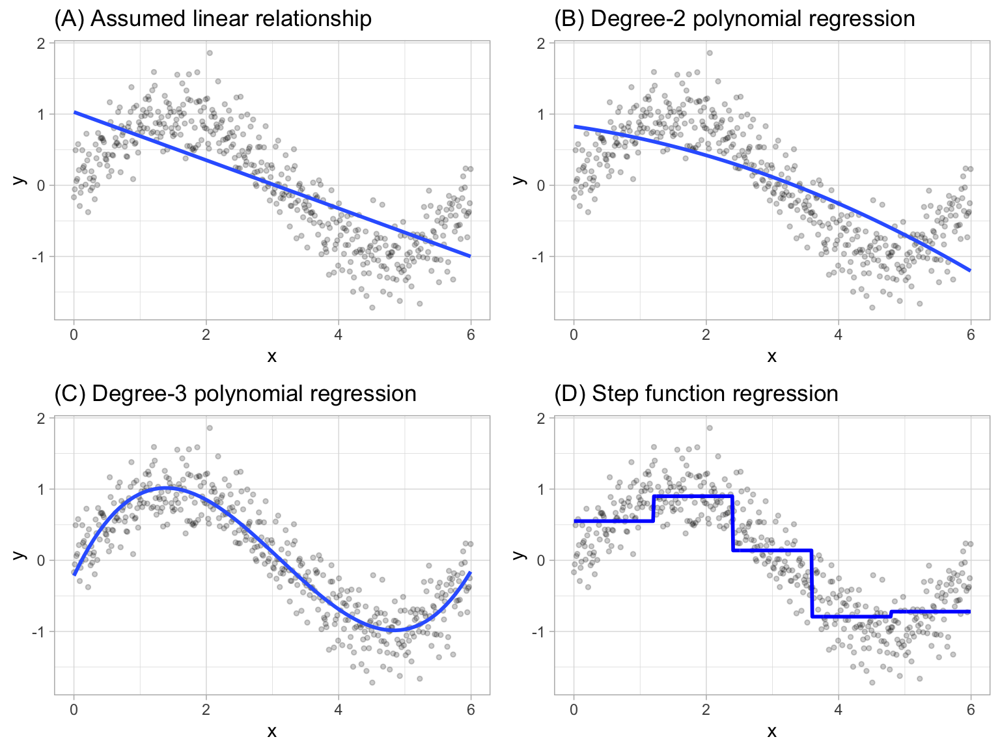
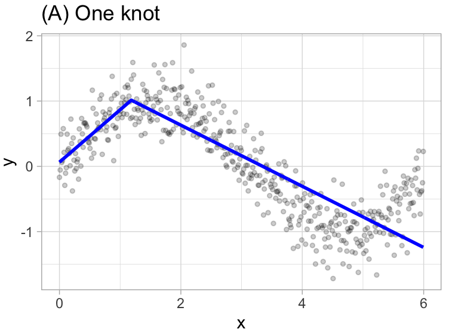
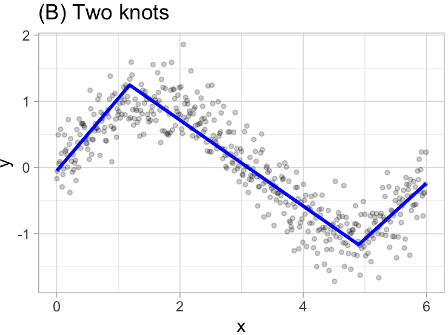
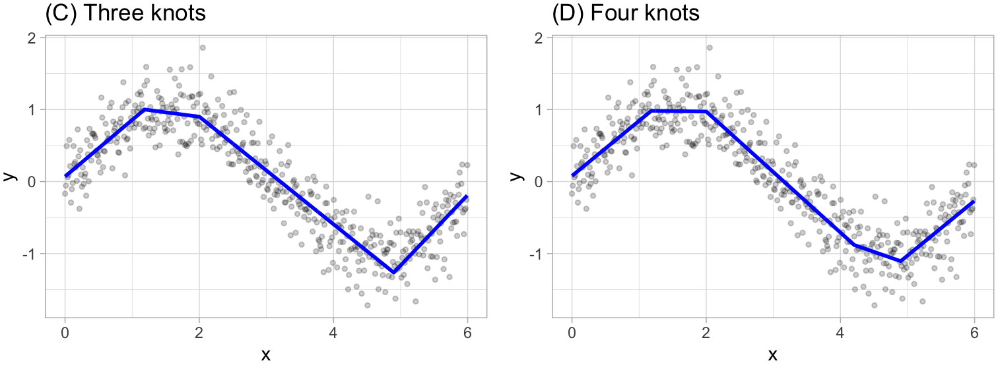
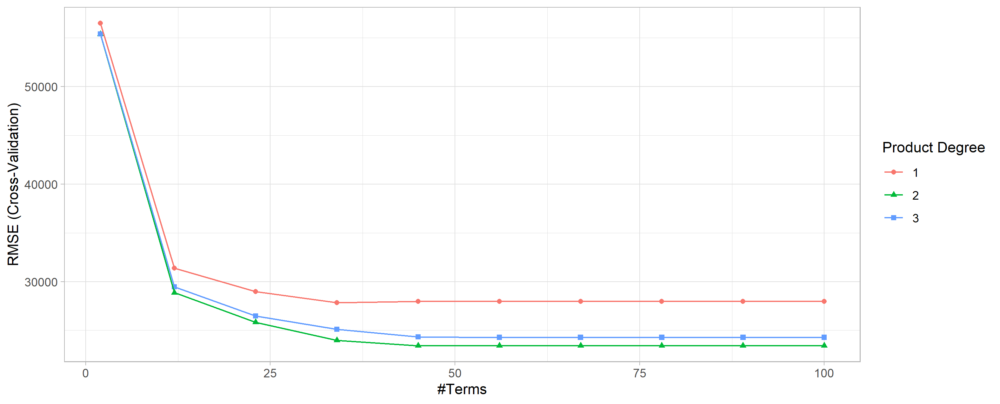
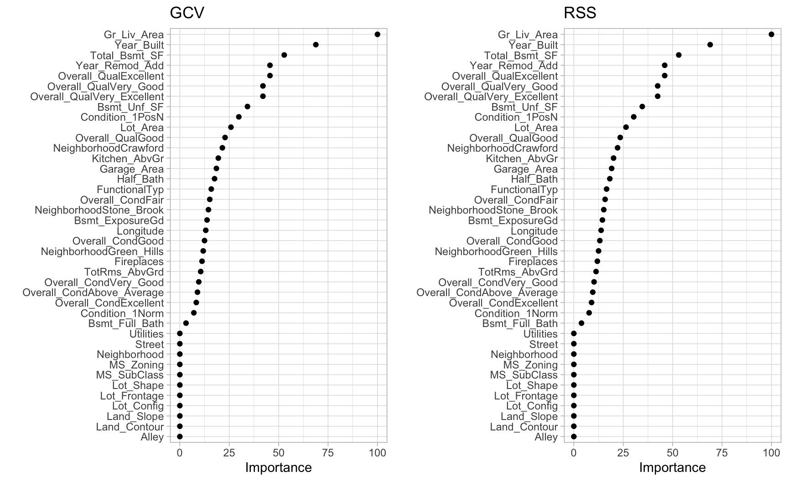
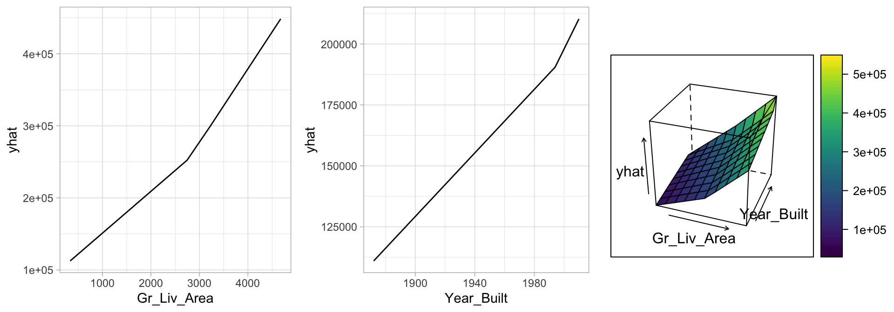

# Multivariate Adaptive Regression Splines (MARS)

<br>
<br>

|Lineal models|Nonlinear models|
|:------------|:---------------|
|If you know **a priori** the nature of a nonlinear relation you could **manually adapt the model** to take in consideration the nonlinear patters by including *polynomial terms* or *step functions*|The model would find the important nonlinear interactions present in the data|

## Extending linear models {-}

- **Polynomial regression**: It extends the *linear model* by adding extra predictors, obtained by *raising each of the original predictors to a power*. Generally speaking, it is unusual to use $d$ greater than 3 or 4 as the larger $d$ becomes, the easier the function fit becomes **overly flexible** and oddly shaped as it tends to increase the presence of **multicollinearity**.

$$
y_i = \beta_0 + \beta_1 x_i + \beta_2 x_i^2 + \beta_3 x_i^3 + \dots + \beta_d x_i^d + \epsilon_i
$$

- **Piecewise constant regression**: It's a **step function** which breaks the range of $X$ into bins and fit a simple constant (e.g., the mean response) in each bin.

If we define the cutpoints as $c_1, c_2, \dots, c_K$ in the range of *X*, we can create *dummy variables* to represent each range. For example, if $c_1 \leq x_i < c_2$ is `TRUE` then $C_1(x_i) = 1$ and then we need to repeat that process for each value of $X$ and range. As result we can fit a *lineal regression* based on the new variables.

$$
y_i = \beta_0 + \beta_1 C_1(x_i) + \beta_2 C_2(x_i)  \dots + \beta_K C_K(x_i) + \epsilon_i
$$

{fig-align="center"}

## Explaning the model {-}

MARS is an algorithm that **automatically creates a piecewise linear model** after grasping the concept of multiple linear regression.

It will first look for the **single point across the range of **$X$ values where two different linear relationships between $Y$ and $X$ achieve the smallest error (e.g., Sum of Squares Error). What results is known as a hinge function $h(x-a)$, where $a$ is the **cutpoint value** (*knot*).

For example, let's use $1.183606$ the our first knot.

$$
y =
\begin{cases}
\beta_0 + \beta_1(1.183606 - x) & x < 1.183606, \\
\beta_0 + \beta_1(x - 1.183606) & x < 1.183606 \\
\end{cases}
$$

{fig-align="center"}

Once the first knot has been found, the search continues for a second knot.

$$
y =
\begin{cases}
\beta_0 + \beta_1(1.183606 - x) & x < 1.183606, \\
\beta_0 + \beta_1(x - 1.183606) & x < 1.183606 \quad \& \quad x < 4.898114 \\
\beta_0 + \beta_1(4.898114 - x) & x > 4.898114
\end{cases}
$$

{fig-align="center"}

This procedure continues until $R^2$ change by less than 0.001.

{fig-align="center"}

Then the model starts the **pruning** process, which consist in using **cross-validation** to remove knots that do not contribute significantly to predictive accuracy. To be more specific the package used in `R` performs a **Generalized cross-validation** which is a **shortcut** for linear models that produces an **approximate leave-one-out cross-validation** error metric.

## Loading prerequisites {-}

We can fit a direct engine MARS model with the `earth` (Enhanced Adaptive Regression Through Hinges) package, as "MARS" is trademarked and licensed exclusively to *Salford Systems* and cannot be used for *competing software solutions*.

### Libraries to use

```{r, warning=FALSE, message=FALSE}
# Helper packages for data wrangling and awesome plotting
library(dplyr)
library(recipes)
library(ggplot2)   

# Modeling packages for fitting MARS models
# and automating the tuning process
library(earth)
library(caret)
library(rsample)
library(parsnip)

# Model interpretability packages
# for variable importance and relationships
library(vip)
library(pdp)
```

### Data to use

```{r}
set.seed(123)

ames_split <- 
  initial_split(
    AmesHousing::make_ames(), 
    prop = 0.7, 
    strata = "Sale_Price"
  )

ames_train  <- training(ames_split)
ames_test   <- testing(ames_split)
```


## Explaning model's summary {-}

Let's explain the summary of a trained model.

```{r}
mars1 <- 
  earth(Sale_Price ~ ., data = ames_train)

mars1
```

1. The number of terms correspond to the number of coefficients used by the model.

```{r}
coef(mars1) |> length()
```

```{r}
summary(mars1)$coefficients |> head(7)
```

2. The number of predictors is counted after transforming all factors into dummy variables.

```{r}
recipe(Sale_Price ~ ., data = ames_train) |>
  step_dummy(all_nominal_predictors()) |>
  prep(training = ames_train) |>
  bake(new_data = NULL) |>
  select(-Sale_Price) |>
  ncol()
```

3. Shows the path used by `earth` to select the model with different metrics

```{r}
plot(mars1, which = 1)
```

It's also important to point out that this package has the capacity to assess potential interactions between different hinge functions.

```{r}
earth(Sale_Price ~ ., 
      data = ames_train,
      degree = 2) |>
  summary() |>
  (\(x) x$coefficients)() |>
  head(10)
```


## Tuning Process {-}

There are two important tuning parameters associated with our MARS model:

- `degree`: the maximum degree of interactions, where rarely is there any benefit in assessing greater than *3-rd degree interactions*.
- `nprune`: Maximum number of terms (including intercept) in the pruned model, where you can start out with *10 evenly spaced values*.

```{r}
# create a tuning grid
hyper_grid <- expand.grid(
  degree = 1:3, 
  nprune = seq(2, 100, length.out = 10) |> floor()
)

head(hyper_grid)
```

### Caret

```{r, eval=FALSE}
# Cross-validated model
set.seed(123)  # for reproducibility
cv_mars <- train(
  x = subset(ames_train, select = -Sale_Price),
  y = ames_train$Sale_Price,
  method = "earth",
  metric = "RMSE",
  trControl = trainControl(method = "cv", number = 10),
  tuneGrid = hyper_grid
)


# View results
cv_mars$bestTune
##    nprune degree
## 16     45      2


cv_mars$results |>
  filter(nprune == cv_mars$bestTune$nprune, 
         degree == cv_mars$bestTune$degree)
#   degree nprune     RMSE  Rsquared     MAE RMSESD RsquaredSD    MAESD
# 1      2     45 23427.47 0.9156561 15767.9 1883.2 0.01365285 794.2688
```


```{r, eval=FALSE}
ggplot(cv_mars)+
  theme_light()
```

{fig-align="center"}

```{r, eval=FALSE}
cv_mars$resample$RMSE |> summary()
#  Min. 1st Qu.  Median    Mean 3rd Qu.    Max. 
# 20735   22053   23189   23427   24994   26067 


cv_mars$resample
#        RMSE  Rsquared      MAE Resample
# 1  23243.22 0.9387415 15777.98   Fold04
# 2  23044.17 0.9189506 15277.56   Fold03
# 3  23499.99 0.9205506 16190.29   Fold07
# 4  23135.62 0.9226565 16106.93   Fold01
# 5  25491.41 0.8988816 16255.55   Fold05
# 6  21414.96 0.9202359 15987.68   Fold08
# 7  21722.58 0.9050642 14694.66   Fold02
# 8  26066.88 0.8938272 16635.14   Fold06
# 9  20735.28 0.9274782 14226.06   Fold10
# 10 25920.58 0.9101751 16527.20   Fold09
```


### Tidymodels

The main benefit of using `tidymodels` to perform 10-CV is that you can stratify the folds, which can be very useful taking in consideration that the target variable is *right-skewed*.

```{r, message=FALSE}
ggplot(ames_train, aes(Sale_Price))+
  geom_histogram(fill = "blue", alpha = 0.6)+
  theme_light()
```

1. Define the model to train

```{r, eval=FALSE}
mars_model <- 
  mars() |>
  set_mode("regression") |>
  set_engine("earth") |>
  set_args(nprune = tune(),
           degree = tune())

```

2. Define the recipe to use

```{r, eval=FALSE}
mars_recipe <-
  recipe(Sale_Price ~ ., data = ames_train) |>
  step_dummy(all_nominal_predictors()) |>
  prep(training = ames_train) 
```


3. Create a `workflow` object to join the model and recipe.

```{r, eval=FALSE}
mars_wf <-
  workflows::workflow() |>
  workflows::add_recipe(mars_recipe) |>
  workflows::add_model(mars_model)
```


4. Create the folds with `rsample`

```{r, eval=FALSE}
set.seed(123)

ames_folds <-
  vfold_cv(ames_train,
           v = 10,
           strata = Sale_Price)

```

5. Getting metrics for each resample

```{r, eval=FALSE}
mars_rs_fit <-
  mars_wf |>
  tune::tune_grid(resamples = ames_folds,
                  grid = hyper_grid,
                  metrics = yardstick::metric_set(yardstick::rmse))
```

6. Check the winner's parameters

```{r, eval=FALSE}

mars_rs_fit |>
  tune::show_best(metric = 'rmse', n = 3)

#   nprune degree .metric .estimator   mean     n std_err .config              
#    <dbl>  <int> <chr>   <chr>       <dbl> <int>   <dbl> <chr>                
# 1      2      1 rmse    standard   25808.    10   1378. Preprocessor1_Model01
# 2      2      2 rmse    standard   25808.    10   1378. Preprocessor1_Model02
# 3      2      3 rmse    standard   25808.    10   1378. Preprocessor1_Model03


final_mars_wf <-
  mars_rs_fit |>
  tune::select_best(metric = 'rmse') |>
  tune::finalize_workflow(x = mars_wf)

# ══ Workflow ════════════════════════════════
# Preprocessor: Recipe
# Model: mars()
# 
# ── Preprocessor ────────────────────────────
# 1 Recipe Step
# 
# • step_dummy()
# 
# ── Model ───────────────────────────────────
# MARS Model Specification (regression)
# 
# Engine-Specific Arguments:
#   nprune = 2
#   degree = 1
# 
# Computational engine: earth 

```

## Feature interpretation {-}

The `vip` package importance will measure the impact of the prediction error as a proportion of the total error features are included (*Generalized cross-validation*).


```{r, eval=FALSE}
# variable importance plots
p1 <- 
  vip(cv_mars, num_features = 40, geom = "point", value = "gcv") +
  ggtitle("GCV")

p2 <- 
  vip(cv_mars, num_features = 40, geom = "point", value = "rss") +
  ggtitle("RSS")

gridExtra::grid.arrange(p1, p2, ncol = 2)
```

{fig-align="center"}

However, it does not measure the impact for particular hinge functions created for a given feature. To see the effect we need to create a plot for each predictor.

```{r, eval=FALSE}
# Construct partial dependence plots
p1 <- 
  partial(cv_mars, pred.var = "Gr_Liv_Area", grid.resolution = 10) |> 
  autoplot()

p2 <- 
  partial(cv_mars, pred.var = "Year_Built", grid.resolution = 10) |> 
  autoplot()

p3 <- 
  partial(cv_mars, pred.var = c("Gr_Liv_Area", "Year_Built"), 
          grid.resolution = 10) %>% 
  plotPartial(levelplot = FALSE, zlab = "yhat", drape = TRUE, colorkey = TRUE, 
              screen = list(z = -20, x = -60))

# Display plots side by side
gridExtra::grid.arrange(p1, p2, p3, ncol = 3)
```

{fig-align="center"}


## Final thoughts {-}

Pros:

- Naturally handles *mixed types of predictors* (quantitative and qualitative)
- Requires *minimal feature engineering*
- Performs automated *feature selection*
- Highly **correlated predictors* do not impede predictive accuracy
- Finds the important nonlinear interactions present in the data

Cons:

- Slower to train
- Correlated predictors can make model interpretation difficult

## Meeting Videos {-}

### Cohort 1 {-}

`r knitr::include_url("https://www.youtube.com/embed/URL")`

<details>
<summary> Meeting chat log </summary>

```
LOG
```
</details>
