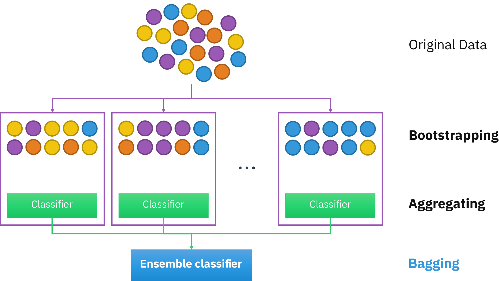
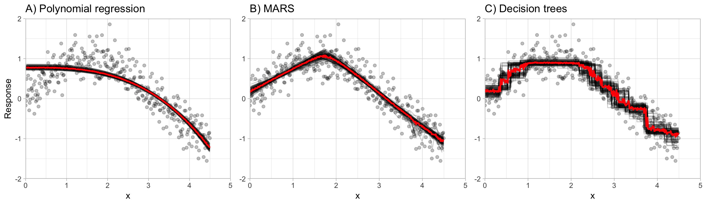
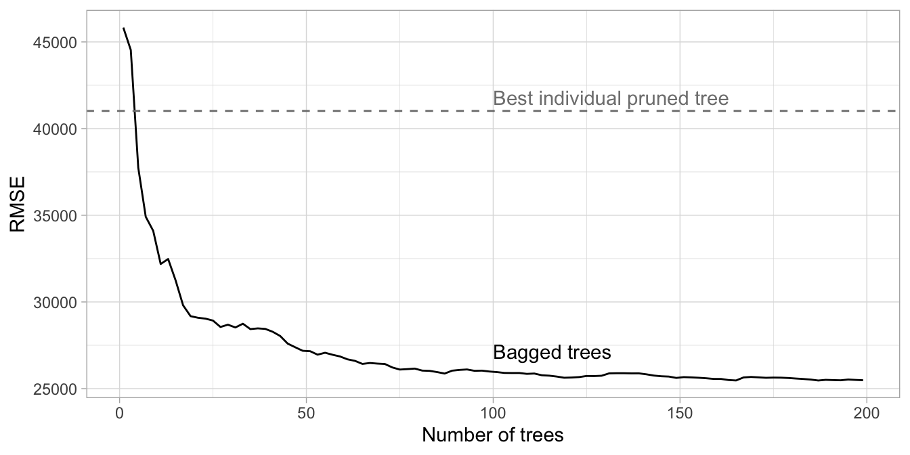

# Bagging (Bootstrap Aggregating)

It's a great way to the **reduce model variance** $\text{Var}(\hat{f}(x_0))$ and **improve accuracy** by reducing **overfitting**.

This method consist in:

- Creating bootstrap copies of the original training data
- Fitting multiple ($[50,500]$) versions of a *base learner* (model), as we need fewer resamples if we have *strong predictors*
- Combining models into an aggregated prediction
  - *Regression:* By averaging the predictions.
  - *Classification:* By averaging the estimated class probabilities or using the plurality vote.

{fig-align="center"}

## It isn't always useful {-}

It isn't very useful when using **stable** or **high bias** models as *base learners*.

{fig-align="center"}

It's important to highlight, that we **don't prune decision trees** to ensure that *low bias* and *high variance* in our *base learner*.

## Out-of-bag (OOB) error {-}

As **we already have resample the data several times**, we don't to do it again to estimate the test error if we have enough resamples $B$.

The **out-of-bag (OOB) error estimation** is approximation to the *leave-one-out cross validation* by taking advantage of the $1/3$ observations that weren't used to train each *base learner* which opens the possibility to calculate $B/3$ predictions, aggregate them and calculate the *test error*.

As your data sets become larger and your bagging iterations increase, it is common to use the *OOB error* estimate as a proxy for predictive performance.

The authors explained an example estimating the RMSE of 200 trees

|Method|RMSE|Needed Time|
|:-------|:---:|:---:|
|10-fold cross validation|26,957|26 minutes|
|OOB error|26,462|0.96 minutes|


## Prerequisites {-}

### Packages to load

```{r}
# Tidymodels machine learning framework
library(rsample)
library(parsnip)

# Helper packages
library(dplyr)       # for data wrangling
library(ggplot2)     # for awesome plotting
library(doParallel)  # for parallel backend to foreach
library(foreach)     # for parallel processing with for loops

# Modeling packages
library(caret)       # for general model fitting
library(rpart)       # for fitting decision trees
library(ipred)       # for fitting bagged decision trees
```

### Data to use

```{r}
set.seed(123)

ames_split <- 
  initial_split(
    AmesHousing::make_ames(), 
    prop = 0.7, 
    strata = "Sale_Price"
  )

ames_train  <- training(ames_split)
ames_test   <- testing(ames_split)
```


## Training bagging trees {-}

- As we are going to apply a random process is important set a seed.
- `nbagg` defines how many iterations to include in the bagged model
- `coob = TRUE` indicates to use the OOB error rate.
- We use the argument `control` from the `rpart` function to change 
  - `minsplit` the *minimum number of observations that must exist in a node to split* from 20 to 2.
  - `cp` 	(complexity parameter) prunes any split that does not improve the fit by `cp` and as we don't want to prune then we change from 0.01 to 0.


```{r}
#| eval: false

# make bootstrapping reproducible
set.seed(123)

# train bagged model
ames_bag1 <- ipred::bagging(
  formula = Sale_Price ~ .,
  data = ames_train,
  nbagg = 100,  
  coob = TRUE,
  control = rpart.control(minsplit = 2, cp = 0)
)

ames_bag1

# Bagging regression trees with 100 bootstrap replications 
# 
# Call: bagging.data.frame(formula = Sale_Price ~ ., data = ames_train, 
#     nbagg = 100, coob = TRUE, control = rpart.control(minsplit = 2, 
#         cp = 0))
# 
# Out-of-bag estimate of root mean squared error:  26216.47
```


## Number of trees and error estimate {-}

1. The more trees the better
2. The error will flatline and stabilize at some number of trees

{fig-align="center"}

## Parallelize training {-}

```{r}
# Create a parallel socket cluster
cl <- makeCluster(8) # use 8 workers
registerDoParallel(cl) # register the parallel backend

# Fit trees in parallel and compute predictions on the test set
predictions <- foreach(
  icount(160), 
  .packages = "rpart", 
  .combine = cbind
) %dopar% {
  # bootstrap copy of training data
  index <- sample(nrow(ames_train), replace = TRUE)
  ames_train_boot <- ames_train[index, ]  
  
  # fit tree to bootstrap copy
  bagged_tree <- rpart(
    Sale_Price ~ ., 
    control = rpart.control(minsplit = 2, cp = 0),
    data = ames_train_boot
  ) 
  
  predict(bagged_tree, newdata = ames_test)
}

# Shutdown parallel cluster
stopCluster(cl)

predictions[1:5, 1:7]
```


## Error curve for custom parallel bagging {-}

```{r error-curve}
predictions %>%
  
  # Adding original Sale_Price
  tidyr::as_tibble() %>%
  mutate(observation = 1:n(),
         actual = ames_test$Sale_Price) %>%
  
  # Transforming the data to long format
  tidyr::gather(tree, predicted, -c(observation, actual)) %>%
  
  # Transforming the tree column to integer to avoid problem arranging
  #   group_by(observation) %>%
  #   mutate(tree = stringr::str_extract(tree, '\\d+') %>% as.numeric()) %>%
  #   ungroup() %>%
  mutate(tree = stringr::str_remove(tree, '^result\\.') %>% as.integer()) %>%
  arrange(observation, tree) %>%
  
  # For each observation Calculate the avg_prediction 
  # with different number of trees
  group_by(observation) %>%
  mutate(avg_prediction = cummean(predicted)) %>%
  
  # Calculate the RMSE for each tree
  group_by(tree) %>%
  summarize(RMSE = RMSE(avg_prediction, actual)) %>%
  
  # Plot the results
  ggplot(aes(tree, RMSE)) +
  geom_line() +
  xlab('Number of trees')+
  theme_light()
```


## Feature interpretation {-}

To infer how features are influencing our model is not enough just to **measure feature importance based on the sum of the reduction in the loss function attributed to each variable at each split** a single tree, then **aggregate** this measure across all trees for each feature.

Since we use many tree, we tend to have many more **features involved but with lower levels of importance**.

```{r feature-importance}
doParallel::registerDoParallel()

set.seed(454)
bagging_model_fit <-
  rand_forest(mtry = ncol(ames_train)-1L,
              trees = 200L,
              min_n = 2L) %>%
  set_engine("randomForest", importance = TRUE) %>%
  set_mode("regression") |>
  fit(Sale_Price ~ ., data = ames_train)

doParallel::stopImplicitCluster()

vip::vip(
  bagging_model_fit,
  num_features = 40,
  geom = "point"
)+
  theme_light()
```


*Partial dependence plots (PDP)* helps us to find **non-linear relationships** between a feature and response.

```{r}
# Construct partial dependence plots
p1 <- pdp::partial(
  bagging_model_fit, 
  pred.var = "Lot_Area",
  grid.resolution = 20,
  train = ames_train
  ) %>% 
  autoplot()+
  theme_light()

p2 <- pdp::partial(
  bagging_model_fit, 
  pred.var = "Lot_Frontage", 
  grid.resolution = 20,
  train = ames_train
  ) %>% 
  autoplot()+
  theme_light()

gridExtra::grid.arrange(p1, p2, nrow = 1)
```

## Final thoughts {-}

- Bagging **improves the prediction accuracy** for high variance (and low bias) models 

- VIPs and PDPs can help to **make inferences** about the how model leverages **feature information**.

- It's **easy to do in parallel** as it performs independent processes.

But

- The trees are **not completely independent of each other** since all the original features are considered at every split of every tree, returning **correlated results** which stop the model for further reducing the variance.


## Meeting Videos {-}

### Cohort 1 {-}

`r knitr::include_url("https://www.youtube.com/embed/URL")`

<details>
<summary> Meeting chat log </summary>

```
LOG
```
</details>
