# Interpretable Machine Learning

```{r, 16-setup, include=FALSE}
knitr::opts_chunk$set(
  eval = FALSE
)
```

**Learning objectives:**

1. Understand the importance of interpretability in machine learning models.
2. Learn about global and local interpretation.
3. Understand the trade-off between interpretation and performance.
4. Learn about model-specific and model-agnostic methods.
5. Understand the concept of permutation-based feature importance.
6. Understand the concept of partial dependence.
7. Learn about Individual Conditional Expectation (ICE).
8. Explain different methods to find interactions.
9. Explain the main features for local observations.

## Introduction

Model's **interpretability** is crucial for:

- Business adoption
- Model documentation
- Regulatory oversight
- Human acceptance and trust

**Interpretable Machine Learning** provides solutions to explain at different levels.

- **Global Interpretation** explain  how the model makes predictions, based on a holistic view of its **features**. They can explain:
  - which features are the most influential (via **feature importance**)
  - How the most influential variables drive the model output (via **feature effects**)

- **Local Interpretation** becomes very important when the effect of most influential model's features doesn't the biggest influence for a particular observation as it helps us to understand what **features are influencing the predicted response** for a given observation or an small group of observations.
  - Local interpretable model-agnostic explanations (LIME)
  - Shapley values
  - Localized step-wise procedures

## Setting enviroment

### Loading libraries

```{r 16-libraries, message=FALSE, echo=TRUE, results='hide'}
# Helper packages
library(dplyr)      # for data wrangling
library(ggplot2)    # for awesome graphics

# Modeling packages
library(h2o)       # for interfacing with H2O
library(recipes)   # for ML recipes
library(rsample)   # for data splitting
library(xgboost)   # for fitting GBMs

# Model interpretability packages
library(pdp)       # for partial dependence plots (and ICE curves)
library(vip)       # for variable importance plots
library(iml)       # for general IML-related functions
library(DALEX)     # for general IML-related functions
library(lime)      # for local interpretable model-agnostic explanations
```

### Getting the data

```{r 16-getting-data, message=FALSE, echo=TRUE, results='hide'}
# Load and split the Ames housing data
ames <- AmesHousing::make_ames()

# for reproducibility
set.seed(123)  
split <- initial_split(ames, strata = "Sale_Price")
ames_train <- training(split)
ames_test <- testing(split)

# Make sure we have consistent categorical levels
blueprint <- recipe(Sale_Price ~ .,
                    data = ames_train) %>%
  step_other(all_nominal(),
             threshold = 0.005)

# Starting H2O
h2o.init(max_mem_size = "10g")
options(timeout = 5000)

# Create training set for h2o
train_h2o <- prep(blueprint,
                  training = ames_train,
                  retain = TRUE) %>%
  juice() %>%
  as.h2o()

# Create testing set for h2o
test_h2o <- prep(blueprint,
                 training = ames_train) %>%
  bake(new_data = ames_test) %>%
  as.h2o()

# Get response and feature names
Y <- "Sale_Price"
X <- setdiff(names(ames_train), Y)
```

### Training the model

```{r 16-train-base-learners}
# Regularized regression base learner
best_glm <- h2o.glm(
  x = X,
  y = Y,
  training_frame = train_h2o,
  alpha = 0.1,
  remove_collinear_columns = TRUE,
  nfolds = 10,
  fold_assignment = "Modulo",
  keep_cross_validation_predictions = TRUE,
  seed = 123
)

# Random forest base learner
best_rf <- h2o.randomForest(
  x = X,
  y = Y,
  training_frame = train_h2o,
  ntrees = 500,
  mtries = 20,
  max_depth = 30,
  min_rows = 100,
  sample_rate = 0.8,
  nfolds = 10,
  fold_assignment = "Modulo",
  keep_cross_validation_predictions = TRUE,
  seed = 123,
  stopping_rounds = 50,
  stopping_metric = "RMSE",
  stopping_tolerance = 0
)


# GBM base learner
best_gbm <- h2o.gbm(
  x = X,
  y = Y,
  training_frame = train_h2o,
  ntrees = 500,
  learn_rate = 0.01,
  max_depth = 7,
  min_rows = 5,
  sample_rate = 0.8,
  nfolds = 10,
  fold_assignment = "Modulo",
  keep_cross_validation_predictions = TRUE,
  seed = 123,
  stopping_rounds = 50,
  stopping_metric = "RMSE",
  stopping_tolerance = 0
)

# XGBoost base learner
#   We cannot run this under Windows

# Stacked model
ensemble_tree <- h2o.stackedEnsemble(
  x = X,
  y = Y,
  training_frame = train_h2o,
  model_id = "my_tree_ensemble",
  base_models = list(best_glm, best_rf, best_gbm),
  # Meta learner: random forest
  metalearner_algorithm = "drf"
)
```

### Defining Local Observations to Explain

```{r 16-local_values}
# Compute predictions
predictions <- predict(ensemble_tree,
                       train_h2o) |> 
  as.vector()

max(predictions) |>
  scales::dollar() |>
  paste("Observation",
        which.max(predictions), 
        "has a predicted sale price of",
        a = _)

min(predictions) |>
  scales::dollar() |>
  paste("Observation",
        which.min(predictions), 
        "has a predicted sale price of",
        a = _) 


# Grab feature values for observations with min/max predicted sales price
high_ob <- as.data.frame(train_h2o)[which.max(predictions), ] |> 
  select(-Sale_Price)

low_ob  <- as.data.frame(train_h2o)[which.min(predictions), ] |>
  select(-Sale_Price)
```


## Interpretation trade-off

In prior chapters we have been using *model-specific* as they are closer **tied to the model performance**, but you would be facing the next limitations:

- Not all *models have a method*. For example, the *stacked model* we trained during last chapter.
- Comparing feature importance across model classes is difficult *since you are comparing different measurements*.

**There isn't a Best Approach**

> The only way to **full trust** our model interpretations is to apply multiple approaches *including model specific and model agnostic results*.


## Model-specific implementation

By reviewing the documentation of the `vip::vi_model` functions we can see some descriptions some methods work, some of the use **permutation** (*sampling without replacement*) to validate importance.

|Source package |Method Description|
|:--------|:-----------------------------|
|**lm**| It uses the absolute value of the  **$t$–statistic** as a measure of feature importance|
|**glmnet**| It uses the absolute value of the **coefficients** are returned for a specific model, so it's important to standardized the features prior fitting the model. We can specify which coefficients to return by passing the specific value of the penalty parameter via the `lambda`|
|**earth**|1. `type = "nsubsets"` counts the number of **model subsets that include each feature**. Variables that are included in more subsets are considered more important. <br> <br> 2. `type = "rss"` **calculates the decrease in the RSS for each subset** relative to the previous subset during earth()’s backward pass. Then it **sums these decreases** over all subsets that include **each variable** and **scale the result** to report 100 for the variable associated with the **larger net decrease**. <br> <br> 3. `type = "gcv"` which is a shortcut for *leave-one-out cross validation* and follow the same strategy as the *rss* with the difference that a variable might have a negative total importance as this measure no always decrease.|
|**rpart**|It records the **sum of the goodness of split** for each split and variable  plus "goodness"* for all **splits in which it was a surrogate**.|
|**randomForest**|1. `type = 1` (*mean decrease in accuracy*) **records** the prediction out-of-bag **error rate or MSE** for each tree, then repeats the process after **permuting each predictor** variable, calculate the *difference between both errors*, takes the average over all trees and normalized the results using the standard deviation of the differences. <br> <br> 2. `type = 2` (*mean decrease in node impurity*) is the total decrease in node impurities (**Gini index** or **residual sum of squares**) from splitting on the variable, averaged over all trees.|
|**gbm**|1. If `type = "relative.influence"` and `distribution = "gaussian"` this returns the reduction of squared error attributable to each variable. <br> <br> 2. If  `distribution != "gaussian"` returns the reduction attributable to each variable in **sum of squared error** in predicting the gradient on **each iteration** to report the relative influence of each variable in **reducing the loss function**. <br> <br> 3. If `type = "permutation"` it **randomly permutes each predictor variable** at a time and computes the associated reduction in **predictive performance** using using the **entire training dataset**.|
|**xgboost**|1. For linear models, the importance is the absolute magnitude of linear coefficients. <br> <br> 2. For tree models and `type = "gain"` it gives the **fractional contribution of each feature** to the model based on the total gain (*sum of the improvements in accuracy brought by that feature to all the branches it is on.*) of the corresponding feature's splits. <br> <br> 3. For tree models and `type = "cover"` it gives the number of observations related to each feature. <br> <br> 4. For tree models and `type = "frequency"` it gives the percentages representing the relative number of times each feature has been used throughout each tree in the ensemble.

## Permutation-based feature importance

### Concept

We can use this method for any model after assuring that:

- **The model isn't overfitting**: To avoid interpreting *noise* rather than *signal*.
- **Features present low correlation**: To avoid under estimating the importance of correlated features, as permuting a feature without permuting its correlated pairs won't have a big effect.

It measures feature’s importance by calculating the **increase of the model’s prediction error**, by taking the *difference to interpret absolute values* or the *ratio to interpret relative values* of a metric like the *RMSE* after **permuting the feature**, as describes the next *algorithm*:

```
For any given loss function do the following:
1. Compute loss function for original model
2. For variable i in {1,...,p} do
     | randomize values
     | apply given ML model
     | estimate loss function
     | compute feature importance (some difference/ratio measure 
       between permuted loss & original loss)
   End
3. Sort variables by descending feature importance
```

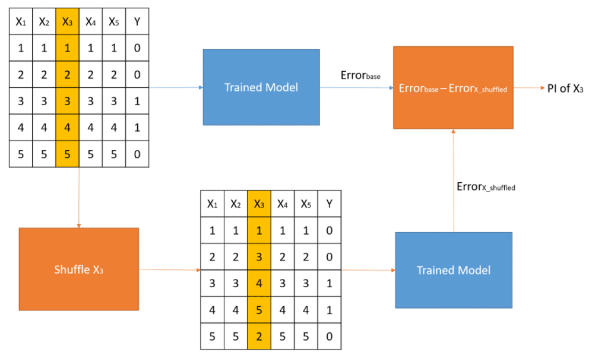

### Implementation

**General Description**

|**Package**|**Function**|**Description**|
|:----------|:-----------|:--------------|
|**iml**|`FeatureImp()`|- Several loss functions (`loss = "mse"`) <br> - Difference and ratio calculations.|
|**DALEX**|`variable_importance()`|- Several loss functions. <br> - Difference and ratio calculations. <br> - It can sample the data (`n_sample = 1000`)|
|**vip**|`vip()` or `vi_permute()`|- Supports model-specific and model-agnostic approaches. <br> - Custom and several loss functions. <br> - Perform a Monte Carlo simulation to stabilize the procedure. (`nsim = 5`) <br> - It can sample the data (`sample_size` or `sample_frac`) <br> - It can perform parallel computations (`parallel = TRUE`)|

**Creating Needed Objects**

```{r 16-support-objects}
# For iml and DALEX
# 1) Split the features and response
features <- as.data.frame(train_h2o) |> select(-Sale_Price)
response <- as.data.frame(train_h2o) |> pull(Sale_Price)

# 2) Create custom predict function that returns the predicted values as a vector
pred <- function(object, newdata)  {
  results <- as.vector(h2o.predict(object, as.h2o(newdata)))
  return(results)
}

## For DALEX
components_dalex <- DALEX::explain(
  model = ensemble_tree,
  data = features,
  y = response,
  predict_function = pred
) 
```

**iml**

```{r 16-iml-permutation}
Predictor$new(ensemble_tree, data = features, y = response) |>
  FeatureImp$new(loss = "rmse", compare = "difference") |>
  plot()
```


**DALEX**

```{r 16-DALEX-permutation}
loss_default(components_dalex$model_info$type)

model_parts(components_dalex,
            type = "difference") |>
  plot()
```


**vip**

```{r 16-vip-permutation}
vip(
  ensemble_tree,
  train = as.data.frame(train_h2o),
  method = "permute",
  target = "Sale_Price",
  metric = "RMSE",
  type = "difference",
  nsim = 5,
  sample_frac = 0.5,
  pred_wrapper = pred
)
```

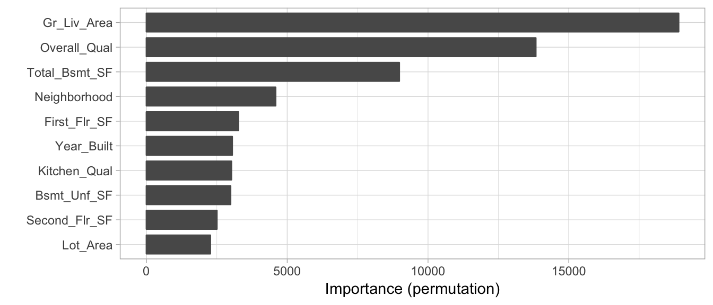

## Partial dependence

### Concept

It allows us to understand **how the response variable changes** as we **change the value of a feature** while taking into account the average effect of all the other features in the model, when the model has **weak interactions between features**.

1. Splitting the feature of interest into  $j$ equally spaced values. For example, if $j = 20$ for the `Gr_Liv_Area` we could write the next code.

```{r 16-j_values, eval=TRUE}
j_values <-
  seq(from = 334,
      to = 5095,
      length.out = 20L) |>
  round(digits = 2)

matrix(j_values, nrow = 5, byrow = TRUE)
```

2. Making $j$ copies of the original training data.

3. For each copy setting the `Gr_Liv_Area` with the corresponding value. For example, the value for first copy will be `r j_values[1L]` and the second `r j_values[2L]` until changing the last copy `r tail(j_values, 1L)`.

4. **Predicting the outcome** for each observation in each of the $j$ copies.

5. **Averaging the predicted values** for each set.

6. **Plotting** the average of each $j$ value.

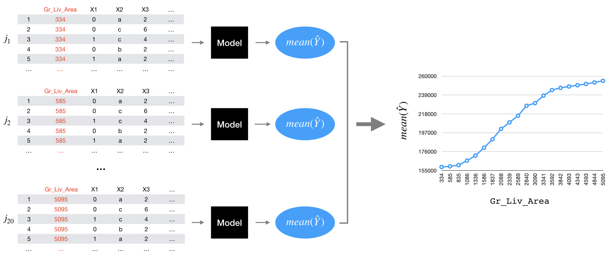


### Implementation

**DALEX**

```{r 16-DALEX-pdp}
dalex_pdp <- model_profile(explainer = components_dalex,
                           variables = "Gr_Liv_Area",
                           N = 20L)

dalex_pdp

plot(dalex_pdp)
```

**pdp**

```{r 16-pdp-pdp}
# Custom prediction function wrapper
pdp_pred <- function(object, newdata)  {
  results <- mean(as.vector(h2o.predict(object, as.h2o(newdata))))
  return(results)
}

# Compute partial dependence values
pd_values <- partial(
  ensemble_tree,
  train = as.data.frame(train_h2o), 
  pred.var = "Gr_Liv_Area",
  pred.fun = pdp_pred,
  grid.resolution = 20
)

head(pd_values)
##   Gr_Liv_Area     yhat
## 1         334 158858.2
## 2         584 159566.6
## 3         835 160878.2
## 4        1085 165896.7
## 5        1336 171665.9
## 6        1586 180505.1

autoplot(pd_values,
         rug = TRUE,
         train = as.data.frame(train_h2o))
```

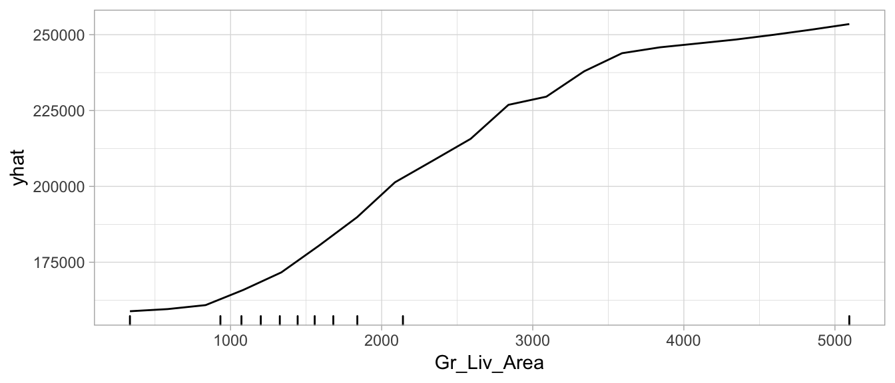

### Adding feature importance

We can assume that those features with **larger marginal effects** on the response have greater importance, this is really useful to create plots of both feature importance and feature effects.

```{r 16-vip-pdp}
pd_imp_values <- vip(
  ensemble_tree,
  train = as.data.frame(train_h2o),
  method = "firm",
  feature_names = "Gr_Liv_Area",
  pred.fun = pdp_pred,
  grid.resolution = 20,
  ice = FALSE
)

head(pd_imp_values)
```

## Individual conditional expectation

### Concept

ICE plots can help to **highlight interactions between features** by showing the predicted response of each instance separately.

**Centering the ICE** curves at the *minimum value of the feature* makes easier to see:

- How effects change as the feature value increases (highlight heterogeneity)
- Observations that deviate from the general pattern.

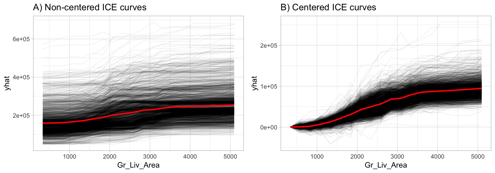

### Implementation

```{r 16-c-ICE-curve}
# Construct c-ICE curves
partial(
  ensemble_tree,
  train = as.data.frame(train_h2o), 
  pred.var = "Gr_Liv_Area",
  pred.fun = pred,
  grid.resolution = 20,
  plot = TRUE,
  center = TRUE,
  plot.engine = "ggplot2"
)
```

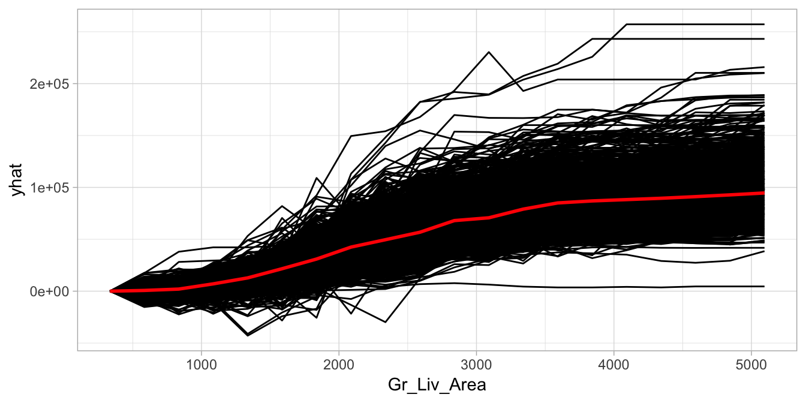


> **PDPs**, **ICE curves** and **c-ICE curves** for classification models are typically plotted on a **logit-type scale** to facilitate interpretation.

## Feature interactions

Most of the relationships between features and some response variable are complex and include **interactions**, but identifying and **understanding the nature** of these interactions can be a challenge, but a number of recent empirical studies have shown that interactions can be uncovered by flexible models.

> Two or more predictors are said to interact if their **combined effect is different** (less or greater) than what we would expect if we were to add the impact of each of their effects when considered alone.

*by Max Kuhn and Kjell Johnson*

The **interaction strength** ($H$-statistic or $\rho$) is to measure how much of the ***variation of the predicted outcome** depends on the interaction of the features using the  **partial dependence values** for the features of interest. 

- $\rho = 0$: When there is no interaction at all.
- $\rho = 1$: If all of variation depends on a given interaction.

We can explore the interaction between:


1. **A feature and all other features**

```
1. For variable i in {1,...,p} do
     | f(x) = estimate predicted values with original model
     | pd(x) = partial dependence of variable i
     | pd(!x) = partial dependence of all features excluding i (computationally expensive)
     | upper = sum(f(x) - pd(x) - pd(!x))
     | lower = variance(f(x))
     | rho = upper / lower
   End
2. Sort variables by descending rho (interaction strength)  
```

2. **2 features**

```
1. i = a selected variable of interest
2. For remaining variables j in {1,...,p} do
     | pd(ij) = interaction partial dependence of variables i and j
     | pd(i) = partial dependence of variable i
     | pd(j) = partial dependence of variable j
     | upper = sum(pd(ij) - pd(i) - pd(j))
     | lower = variance(pd(ij))
     | rho = upper / lower
   End
3. Sort interaction relationship by descending rho (interaction strength) 
```

### Implementation


**A feature and all other features**

> Computing the one-way interaction $H$-statistic took two hours to complete

```{r 16-one-all-interactions}
interact <- Interaction$new(components_iml)

interact$results %>% 
  arrange(desc(.interaction)) %>% 
  head()
##        .feature .interaction
## 1  First_Flr_SF   0.13917718
## 2  Overall_Qual   0.11077722
## 3  Kitchen_Qual   0.10531653
## 4 Second_Flr_SF   0.10461824
## 5      Lot_Area   0.10389242
## 6   Gr_Liv_Area   0.09833997

plot(interact)
```

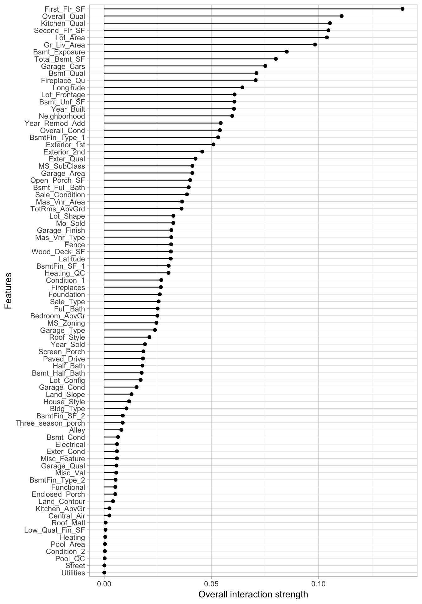


**2 features**

```{r 16-2ways-interactions}
interact_2way <- Interaction$new(components_iml, feature = "First_Flr_SF")

interact_2way$results %>% 
  arrange(desc(.interaction)) %>% 
  top_n(10)
##                      .feature .interaction
## 1   Overall_Qual:First_Flr_SF   0.14385963
## 2     Year_Built:First_Flr_SF   0.09314573
## 3   Kitchen_Qual:First_Flr_SF   0.06567883
## 4      Bsmt_Qual:First_Flr_SF   0.06228321
## 5  Bsmt_Exposure:First_Flr_SF   0.05900530
## 6  Second_Flr_SF:First_Flr_SF   0.05747438
## 7  Kitchen_AbvGr:First_Flr_SF   0.05675684
## 8    Bsmt_Unf_SF:First_Flr_SF   0.05476509
## 9     Fireplaces:First_Flr_SF   0.05470992
## 10  Mas_Vnr_Area:First_Flr_SF   0.05439255
```


**Interactions and response variable relation**

By playing attention to the slope differences we can see that:

- Properties with "good" or lower `Overall_Qual` values **tend to level off their `Sale_Prices`** as `First_Flr_SF` increases, more so than properties with really strong `Overall_Qual values`.

- Properties with "very good" `Overall_Qual` tend to experience a much larger increase in **Sale_Price** as **First_Flr_SF** increases from 1500–2000, compared to most other properties.

```{r 16-interaction-2way-pdp}
interaction_pdp <- Partial$new(
  components_iml, 
  c("First_Flr_SF", "Overall_Qual"), 
  ice = FALSE, 
  grid.size = 20
) 
plot(interaction_pdp)
```

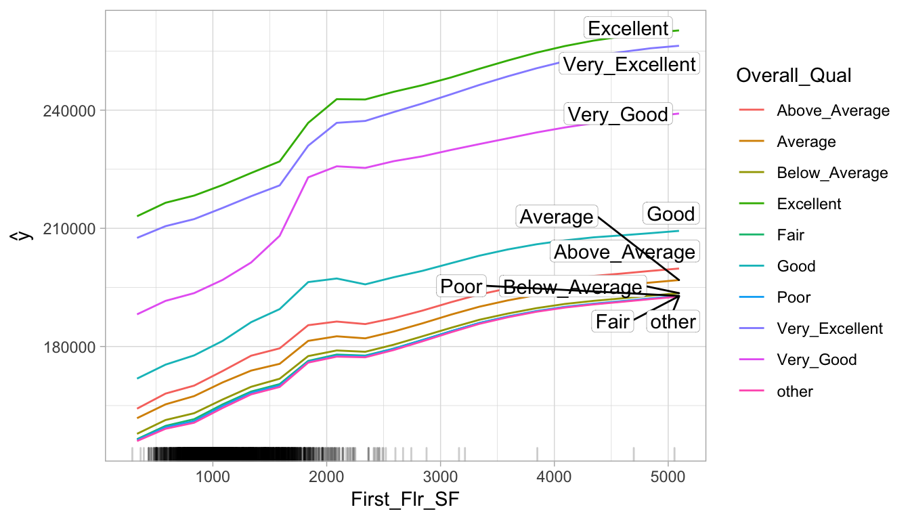

### Alternatives

- **PDP-based variable importance measure** implemented in the `vip::vint()` function.

- Max Kuhn and Kjell Johnson give some strategys to find interactions:

  - **Expert-selected** interactions should be the first to be explored as they might find complex higher-order interactions.
  
  - **Brute-Force Approach** for data sets that have a small to moderate number of predictors.
    - *Simple Screening* of nested statistical models.
    - *Penalized Regression*
    
  - **Two-stage Modeling and Guiding Principles**
    - Start training a model that does not account for interaction effects.
    - Based on the results follow on the next strategies to explain the renamining variation using **2-way** interactions as **three-way** and beyond are almost impossible to interpret, rarely capture a significant amount of response variation and we only need a fraction of the possible effects to explain a significant amount of response variation.
      - **Strong heredity** requires that for an interaction to be considered in a model, *all lower-level preceding terms* must explain a significant amount of response variation.
      - **Weak heredity** relaxes this requirement and would consider *any possible interaction with the significant factor*.

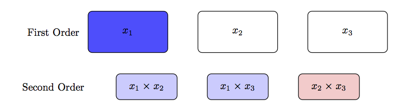
      
  - **Tree-based Methods** as each subsequent node can be thought of as representation of a *localized interaction between the previous node and the current node*.
    - Starting training a **tree-based model**.
    - Estimating the **predictors' importance**.
    - Using must **important predictors** to validate **2-way** interactions using **partial depend plots** or a simpler model like **lineal regression**, as tree-based methods will use predictors involved important interactions multiple times throughout multiple trees to uncover the relationship with the response.
    
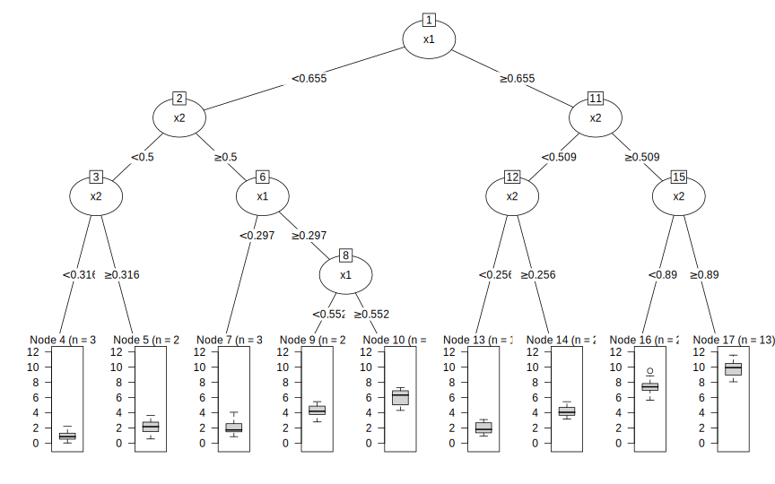

```{r 16-node-4}
node_4 <- I(x1 < 0.655) * I(x2 < 0.5) * I(x2 < 0.316) * 0.939
```


## LIME

*Local Interpretable Model-agnostic Explanations (LIME)* is an algorithm that helps explain individual predictions which assumes that every **complex model is linear on a local scale** after applying the next steps:

1. **Permute** your training data to create new data points that are similar to the original one, but with some changes in the feature values.
2. Compute **proximity measure** (e.g., 1 - distance) between the observation of interest and each of the permuted observations.
3. Apply selected machine learning model to **predict outcomes of permuted data**.
4. Select $m$ number of features to best describe predicted outcomes.
5. **Fit a simple model** (LASSO) to the permuted data, explaining the complex model outcome with $m$ features from the permuted data weighted by its similarity to the original observation.
6. Use the resulting **feature weights** to explain local behavior.

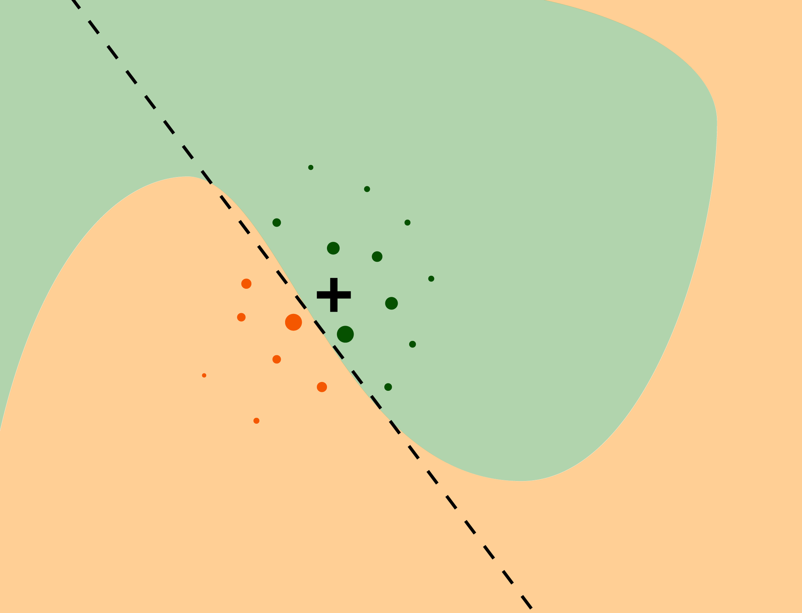

### Implementation

In `R` the algorithm has been written in `iml`, `lime` and `DALEX`. Let's use the `iml` one:

1. Create a list that contains the fitted machine learning model and the feature distributions for the training data. 

```{r 16-explainer-lime }
# Create explainer object
components_lime <- lime::lime(
  x = features,
  model = ensemble_tree, 
  n_bins = 10
)

class(components_lime)
## [1] "data_frame_explainer" "explainer"            "list"

summary(components_lime)
##                      Length Class              Mode     
## model                 1     H2ORegressionModel S4       
## preprocess            1     -none-             function 
## bin_continuous        1     -none-             logical  
## n_bins                1     -none-             numeric  
## quantile_bins         1     -none-             logical  
## use_density           1     -none-             logical  
## feature_type         80     -none-             character
## bin_cuts             80     -none-             list     
## feature_distribution 80     -none-             list
```


2. Perform the LIME algorithm using the `lime::explain()` function on the observation(s) of interest.

```{r 16-lime_explain}
# Use LIME to explain previously defined instances: high_ob and low_ob
lime_explanation <- lime::explain(
  # Observation(s) you want to create local explanations for
  x = rbind(high_ob, low_ob), 
  # Takes the explainer object created by lime::lime()
  explainer = components_lime, 
  # The number of permutations to create for each observation in x
  n_permutations = 5000,
  # The distance function to use `?dist()`
  dist_fun = "gower",
  # the distance measure to a similarity score
  kernel_width = 0.25,
  # The number of features to best describe
  # the predicted outcomes
  n_features = 10, 
  feature_select = "highest_weights"
)

glimpse(lime_explanation)
## Observations: 20
## Variables: 11
## $ model_type       <chr> "regression", "regression", "regression", "regr…
## $ case             <chr> "1825", "1825", "1825", "1825", "1825", "1825",…
## $ model_r2         <dbl> 0.41661172, 0.41661172, 0.41661172, 0.41661172,…
## $ model_intercept  <dbl> 186253.6, 186253.6, 186253.6, 186253.6, 186253.…
## $ model_prediction <dbl> 406033.5, 406033.5, 406033.5, 406033.5, 406033.…
## $ feature          <chr> "Gr_Liv_Area", "Overall_Qual", "Total_Bsmt_SF",…
## $ feature_value    <int> 3627, 8, 1930, 35760, 1796, 1831, 3, 14, 1, 3, …
## $ feature_weight   <dbl> 55254.859, 50069.347, 40261.324, 20430.128, 193…
## $ feature_desc     <chr> "2141 < Gr_Liv_Area", "Overall_Qual = Very_Exce…
## $ data             <list> [[Two_Story_1946_and_Newer, Residential_Low_De…
## $ prediction       <dbl> 663136.38, 663136.38, 663136.38, 663136.38, 663…

plot_features(lime_explanation, ncol = 1)
```

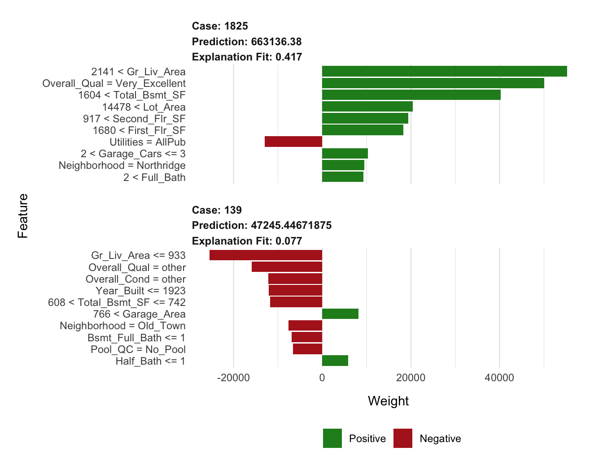

3. Tune the LIME algorithm.

```{r 16-lime-tuned}
 # Tune the LIME algorithm a bit
lime_explanation2 <- explain(
  x = rbind(high_ob, low_ob), 
  explainer = components_lime, 
  n_permutations = 5000,
  dist_fun = "euclidean",
  kernel_width = 0.75,
  n_features = 10, 
  feature_select = "lasso_path"
)

# Plot the results
plot_features(lime_explanation2, ncol = 1)
```
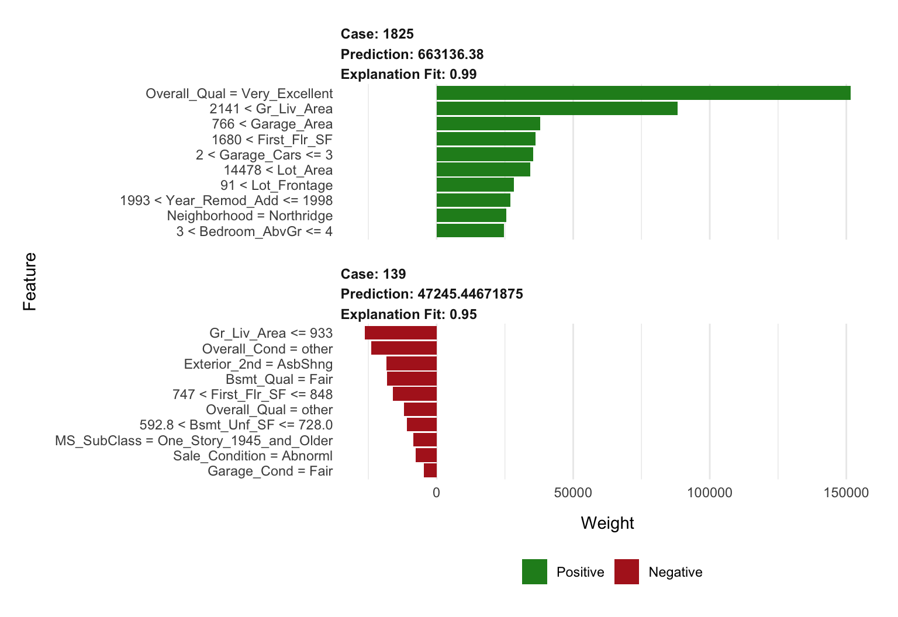

## Shapley values

This method observes how the prediction changes for **each possible subset of features** and then combine these changes to form a unique contribution for each feature value.

To compute the approximate Shapley contribution of feature $x_j$ to $x$ we need to repeat the next process several times (e.g., 10–100) for each feature/observation combination and the results are averaged together.

The aggregated Shapley values ($\phi$ = phi) represent the contribution of each feature towards a predicted value compared to the average prediction for the data set.

A. We sample the training data.

B. We create two copies of an individually sampled row and randomize the order of the features.

  - Then in one copy we include all values from the observation of interest for the values from the first column feature up to and including  $X_1$. We then include the values from the sampled row for all the other features. 
  
  - In the second copy, we include all values from the observation of interest for the values from the first column feature up to but not including $X_1$. We use values from the sample row for $X_1$ and all the other features.
  
C. We apply our model to both copies of this row and in step.

D. We compute the difference between the predicted outputs and calculate the mean of random samples.

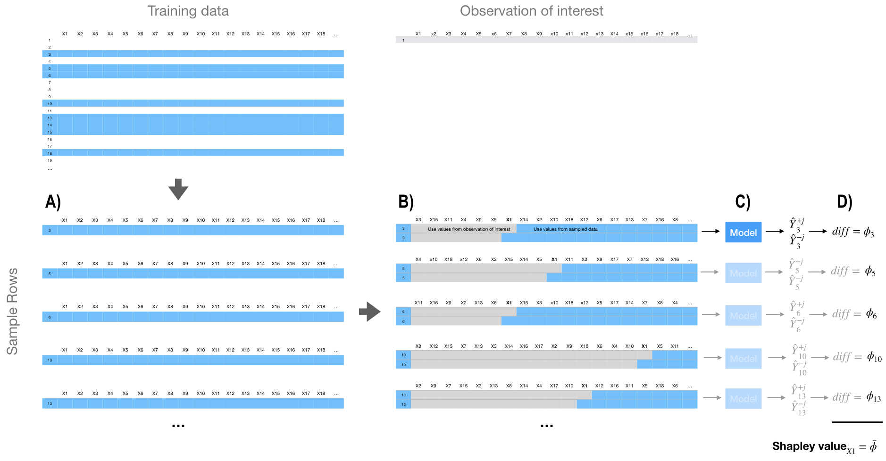

### Implementation

In `R` the algorithm has been written in `iml` and `fastshap`. Let's use the `iml` one:

```{r 16-shapley-high}
# Compute (approximate) Shapley values
(
  shapley <- Shapley$new(
    components_iml,
    x.interest = high_ob,
    sample.size = 1000
  )
)
## Interpretation method:  Shapley 
## Predicted value: 663136.380000, Average prediction: 181338.963590 (diff = 481797.416410)
## 
## Analysed predictor: 
## Prediction task: unknown 
## 
## 
## Analysed data:
## Sampling from data.frame with 2199 rows and 80 columns.
## 
## Head of results:
##        feature         phi      phi.var
## 1  MS_SubClass  1746.38653 4.269700e+07
## 2    MS_Zoning   -24.01968 3.640500e+06
## 3 Lot_Frontage  1104.17628 7.420201e+07
## 4     Lot_Area 15471.49017 3.994880e+08
## 5       Street     1.03684 6.198064e+03
## 6        Alley    41.81164 5.831185e+05
##                          feature.value
## 1 MS_SubClass=Two_Story_1946_and_Newer
## 2    MS_Zoning=Residential_Low_Density
## 3                     Lot_Frontage=118
## 4                       Lot_Area=35760
## 5                          Street=Pave
## 6                Alley=No_Alley_Access

# Plot results
plot(shapley)
```

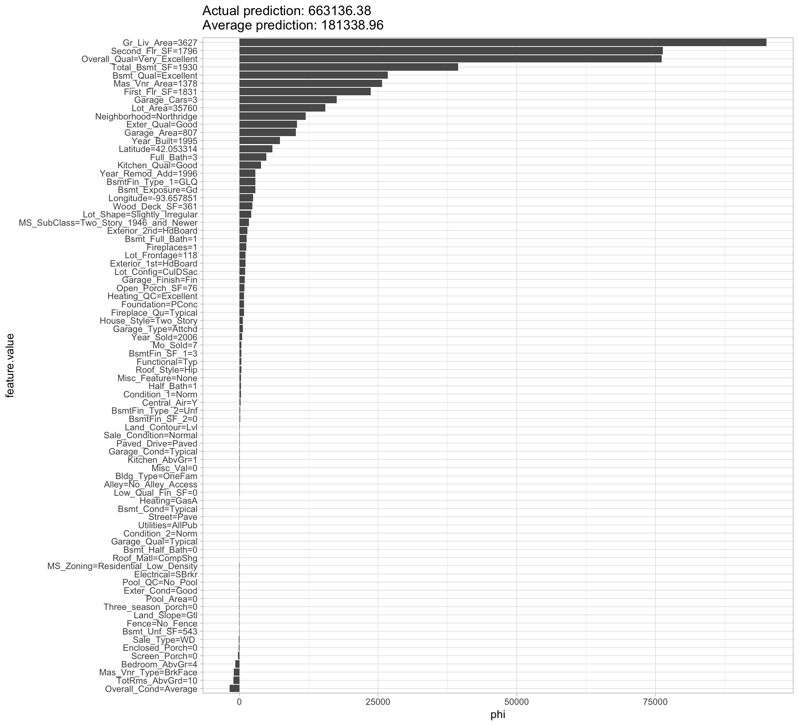

```{r 16-shapley-low}
# Reuse existing object
shapley$explain(x.interest = low_ob)

# Plot results
shapley$results %>%
  top_n(25, wt = abs(phi)) %>%
  ggplot(aes(phi, reorder(feature.value, phi), color = phi > 0)) +
  geom_point(show.legend = FALSE)
```

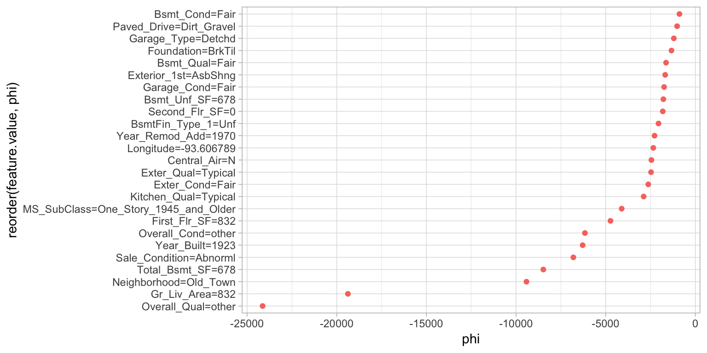


## Localized step-wise procedure

Observing only single feature effects at a time implies that dependencies between features are not taken into account. That could produce **inaccurate and misleading explanations** of the model’s internal logic.

### Implementation

Source: https://ema.drwhy.ai/iBreakDown.html

```{r 16-break-down-data, eval=TRUE}
titanic_imputed <- archivist::aread("pbiecek/models/27e5c")
titanic_rf <- archivist:: aread("pbiecek/models/4e0fc")
(henry <- archivist::aread("pbiecek/models/a6538"))
```

```{r 16-break-down-explaner, eval=TRUE}
library("DALEX")
library("randomForest")

explain_rf <- DALEX::explain(
  model = titanic_rf,  
  data = titanic_imputed[, -9],
  y = titanic_imputed$survived == "yes", 
  label = "Random Forest"
)

bd_rf <- predict_parts(
  explainer = explain_rf,
  new_observation = henry,
  type = "break_down_interactions"
)


bd_rf
```

```{r 16-break-down-plot, eval=TRUE}
plot(bd_rf)
```

```{r 16-stop-h2o}
h2o::h2o.shutdown(prompt = FALSE)
```


## Meeting Videos {-}

### Cohort 1 {-}

`r knitr::include_url("https://www.youtube.com/embed/URL")`

<details>
<summary> Meeting chat log </summary>

```
LOG
```
</details>
