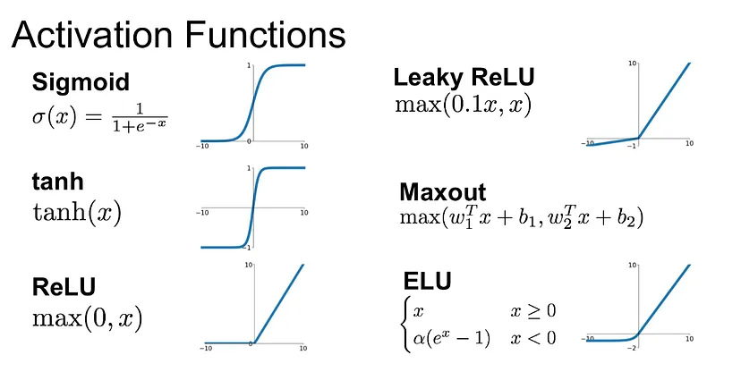
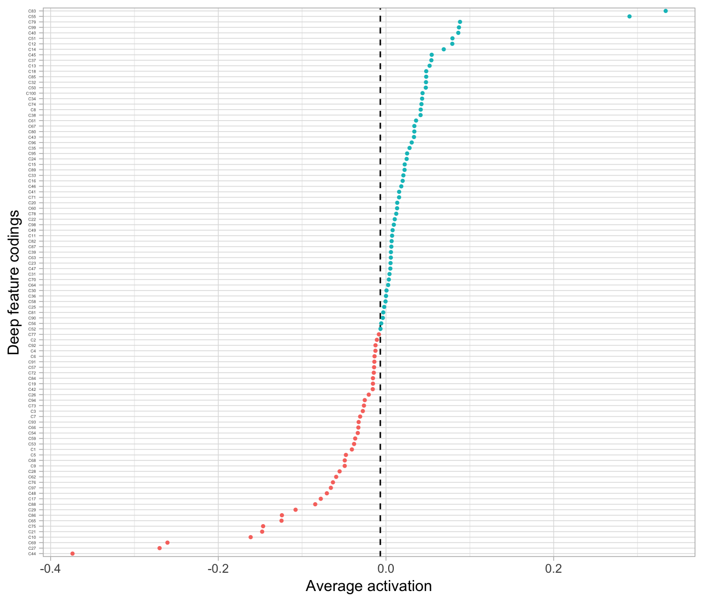

# Autoencoders

**Learning objectives**


## Main Concept 

- *Neural network* 
- Trained to reproduce the *most frequently observed characteristics*
- Returns *efficient representations* of the input data
- Its output layer has the *same number neurons* as number of inputs it receives.

It can be divided in 2 parts:

- *Encoder function* $(Z = f(X))$: Converts $X$ inputs to $Z$ codings.
- *Decoder function* $(X' = g(Z))$: Produces a reconstruction of the inputs $(X')$.


To learn the neuron weights and, thus the codings, the autoencoder seeks to minimize some loss function, such as mean squared error (MSE), that penalizes $X'$ for being dissimilar from  $X$:

$$
\text{minimize} \; \; L = f(X, X')
$$

## Applications

- **Dimension reduction** by using the **encoder function**.

- **Anomaly detection** by using the **reconstruction error** (like MSE) as an anomaly score to detect anomalies.

- **Noise reduction** by  **applying random noise** to the input and asking the mode to recall the original (uncorrupted) input which forces the model focus its attention on the bigger picture.
  
  
- **Information retrieval** is the science of searching for information and auto-encoders can be used to:

  - Compress the text of web pages into a more compact vector representation
  
  - Generate meta tags, snippets, and descriptions for web pages using the page content
  
  - Identify keywords and important concepts within the content of web pages
  
  - Remove noise from the textual data of web pages
  

- **Generative modeling** $P(X|Y=y)$ by using the **decoder**.


## Prerequisites

**Packages**

```r
# Helper packages
library(dplyr)    # for data manipulation
library(ggplot2)  # for data visualization

# Modeling packages
library(h2o)  # for fitting autoencoders
h2o.no_progress()  # turn off progress bars
h2o.init(max_mem_size = "5g")  # initialize H2O instance
```


**Data**

```r
mnist <- dslabs::read_mnist()
names(mnist)
## [1] "train" "test"
```

## Undercomplete autoencoders

As the goal is to create a reduced set of codings that adequately represents $X$ **the number of neurons is less than the number of inputs** which help to capture *the most dominant features and signals*.

### Comparing PCA to an autoencoder

When an autoencoder uses only **linear activation functions** and **MSE as loss function**, then it can be shown that the autoencoder reduces to PCA.

But when **nonlinear activation functions** are used, autoencoders provide nonlinear generalizations of PCA. Here you can see somo activation function:



As we can see bellow, now it is easier to see the difference between groups.


But we need to be aware that some of the **new components can be correlated**.


### Coding example

Let's train an autoencoder with **h2o**.

```r
features <- as.h2o(mnist$train$images)

ae1 <- h2o.deeplearning(

  # Names or indices of the predictor variables 
  x = seq_along(features),
  
  # Training data
  training_frame = features,
  
  # Sets the network as a autoencoder
  autoencoder = TRUE,
  
  # A single hidden layer with only two codings
  hidden = 2,
  
  # Definig activation function
  activation = 'Tanh',
  
  # As 80% of the elements in the MNIST data set are zeros
  # we can speed up computations by defining this option
  sparse = TRUE
  
)
```

```{r, echo=FALSE}
DiagrammeR::grViz("
digraph undercomplete_nn{

  # General properties
  graph [rankdir = LR, overlap = true, fontname = Helvetica]

  # Defining inputs
  node [shape = circle,
        rank = 1,
        ordering='in']
        
  A1[label='1']
  A2[label='2']
  A3[label='...']
  A4[label='784', fontsize = 10]
  
  # Defining output layer
  node[ordering='out',
       rank = 3]
  C1[label='1']
  C2[label='2']
  C3[label='...']
  C4[label='784', fontsize = 10]
  
  # Defining a hideen layer
  node [color = blue,
        rank = 2]
  B1[label='1']
  B2[label='2']

  # Defining 'edge' statements
  A1 -> {B1, B2} 
  A2 -> {B1, B2}
  A3 -> {B1, B2}
  A4 -> {B1, B2}
  B1 -> {C1, C2, C3, C4}
  B2 -> {C1, C2, C3, C4}
}
")

```

Now we can extract the deep features.

```r
ae1_codings <- h2o.deepfeatures(ae1, features, layer = 1)
ae1_codings
##     DF.L1.C1    DF.L1.C2
## 1 -0.1558956 -0.06456967
## 2  0.3778544 -0.61518649
## 3  0.2002303  0.31214266
## 4 -0.6955515  0.13225607
## 5  0.1912538  0.59865392
## 6  0.2310982  0.20322605
## 
## [60000 rows x 2 columns]
```

## Stacked autoencoders

They have **multiple hidden layers** to represent *more complex, nonlinear relationships* at a reduced computational cost and often yield *better data compression*.

As you can see bellow they typically follow a **symmetrical pattern**.


### Tuning hidden layers configuration

1. Creating a grid with different hidden layers configurations

```r
hyper_grid <- list(hidden = list(
  c(50),
  c(100), 
  c(300, 100, 300),
  c(100, 50, 100),
  c(250, 100, 50, 100, 250)
))
```


2. Training a model for each option

```r
ae_grid <- h2o.grid(
  algorithm = 'deeplearning',
  x = seq_along(features),
  training_frame = features,
  grid_id = 'autoencoder_grid',
  autoencoder = TRUE,
  activation = 'Tanh',
  hyper_params = hyper_grid,
  sparse = TRUE,
  ignore_const_cols = FALSE,
  seed = 123
)
```

3. Identifying the best option.

```r
h2o.getGrid('autoencoder_grid', sort_by = 'mse', decreasing = FALSE)
## H2O Grid Details
## ================
## 
## Grid ID: autoencoder_grid 
## Used hyper parameters: 
##   -  hidden 
## Number of models: 5 
## Number of failed models: 0 
## 
## Hyper-Parameter Search Summary: ordered by increasing mse
##                     hidden                 model_ids                  mse
## 1                    [100] autoencoder_grid3_model_2  0.00674637890553651
## 2          [300, 100, 300] autoencoder_grid3_model_3  0.00830502966843272
## 3           [100, 50, 100] autoencoder_grid3_model_4 0.011215307972822733
## 4                     [50] autoencoder_grid3_model_1 0.012450109189122541
## 5 [250, 100, 50, 100, 250] autoencoder_grid3_model_5 0.014410280145600972
```

4. Selecting the best model

```r
best_model_id <- ae_grid@model_ids[[1]]
best_model <- h2o.getModel(best_model_id)
```


5. Validating output layers results visually

```r
# Get sampled test images
index <- sample(1:nrow(mnist$test$images), 4)
sampled_digits <- mnist$test$images[index, ]
colnames(sampled_digits) <- paste0("V", seq_len(ncol(sampled_digits)))

# Predict reconstructed pixel values
reconstructed_digits <- predict(best_model, as.h2o(sampled_digits))
names(reconstructed_digits) <- paste0("V", seq_len(ncol(reconstructed_digits)))

# Combining results
combine <- rbind(
  sampled_digits, 
  as.matrix(reconstructed_digits)
)

# Plot original versus reconstructed
par(mfrow = c(1, 3), mar=c(1, 1, 1, 1))
layout(matrix(seq_len(nrow(combine)), 4, 2, byrow = FALSE))
for(i in seq_len(nrow(combine))) {
  image(matrix(combine[i, ], 28, 28)[, 28:1], xaxt="n", yaxt="n")
}
```


## Sparse autoencoders

They are used to pull out **the most influential feature** representations which helps to:

- Understand what are **the most unique features** of a data set
- Highlight the **unique signals** across the features.

In the context of *tanh activation function*, we consider a neuron active if the output value is closer to 1 and inactive if its output is closer to -1, but we can **increase the number of inactive neurons** by incorporating **sparsity** (*average activation of the coding layer*).

$$
\hat{\rho} = \frac{1}{m} \sum_{i=1}^m A(X)
$$
Let's get it from our example:

```r
ae100_codings <- h2o.deepfeatures(best_model, features, layer = 1)
ae100_codings %>% 
    as.data.frame() %>% 
    tidyr::gather() %>%
    summarize(average_activation = mean(value))
##   average_activation
## 1        -0.00677801
```



The most commonly used penalty is known as the *Kullback-Leibler divergence*  (KL divergence) which measure the divergence between the target probability $\rho$ that a neuron in the coding layer will activate, and the actual probability.

$$
\sum \sum \text{KL} (\rho||\hat{\rho}) = \sum \rho \log{\frac{\rho}{\hat{\rho}}} + (1 - \rho) \log{\frac{1-\rho}{1-\hat{\rho}}}
$$


Now we just need to add the penalty to our loss function with a parameter ($\beta$) to control the weight of the penalty.

$$
\text{minimize} \left(  L = f(X, X') + \beta \sum \text{KL} (\rho||\hat{\rho}) \right)
$$

> Adding sparsity can force the model to represent each input as a combination of a smaller number of activations.

### Tuning sparsity β parameter

```r
# Hyperparameter search grid
hyper_grid <- list(sparsity_beta = c(0.01, 0.05, 0.1, 0.2))

# Execute grid search
ae_sparsity_grid <- h2o.grid(
  algorithm = 'deeplearning',
  x = seq_along(features),
  training_frame = features,
  grid_id = 'sparsity_grid',
  autoencoder = TRUE,
  hidden = 100,
  activation = 'Tanh',
  hyper_params = hyper_grid,
  sparse = TRUE,
  average_activation = -0.1,
  ignore_const_cols = FALSE,
  seed = 123
)

# Print grid details
h2o.getGrid('sparsity_grid', sort_by = 'mse', decreasing = FALSE)
## H2O Grid Details
## ================
## 
## Grid ID: sparsity_grid 
## Used hyper parameters: 
##   -  sparsity_beta 
## Number of models: 4 
## Number of failed models: 0 
## 
## Hyper-Parameter Search Summary: ordered by increasing mse
##   sparsity_beta             model_ids                  mse
## 1          0.01 sparsity_grid_model_1 0.012982916169006953
## 2           0.2 sparsity_grid_model_4  0.01321464889160263
## 3          0.05 sparsity_grid_model_2  0.01337749148043942
## 4           0.1 sparsity_grid_model_3 0.013516631653257992
```

## Additinal references

- Lenny #2: Autoencoders and Word Embeddings: https://ayearofai.com/lenny-2-autoencoders-and-word-embeddings-oh-my-576403b0113a

- Autoencoder: https://en.wikipedia.org/wiki/Autoencoder#Variational_autoencoder_(VAE)

- Understanding Variational Autoencoders (VAEs): https://towardsdatascience.com/understanding-variational-autoencoders-vaes-f70510919f73

- Introduction to Different Activation Functions for Deep Learning: https://medium.com/@shrutijadon/survey-on-activation-functions-for-deep-learning-9689331ba092


## Meeting Videos {-}

### Cohort 1 {-}

`r knitr::include_url("https://www.youtube.com/embed/URL")`

<details>
<summary> Meeting chat log </summary>

```
LOG
```
</details>
