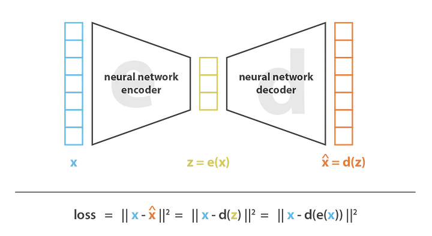
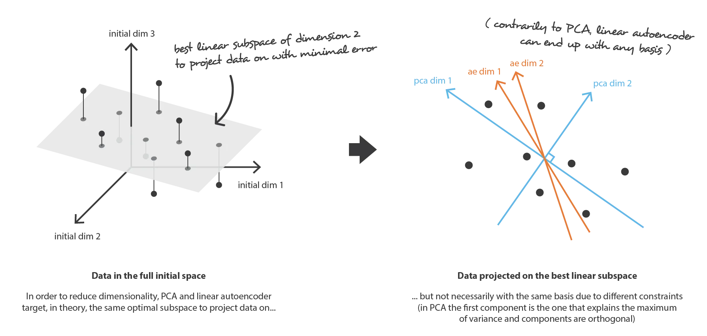
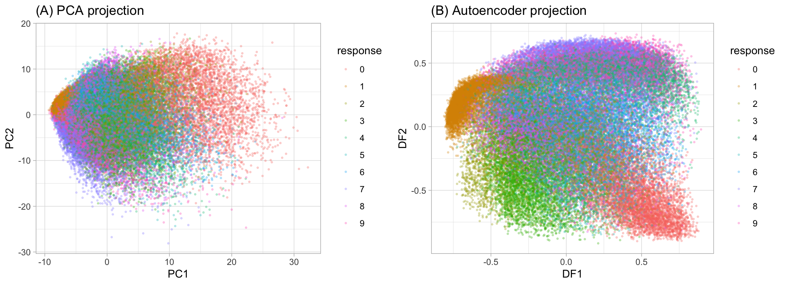
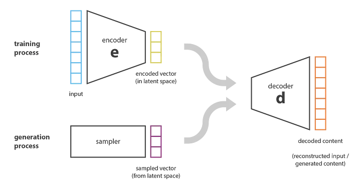
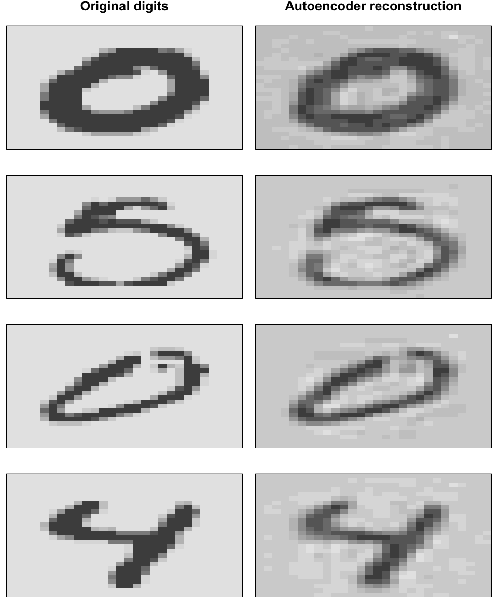

# Autoencoders


## Learning objectives {-}


## Main Concept 

- *Neural network* 
- Trained to reproduce the *most frequently observed characteristics*
- Returns *efficient representations* of the input data
- Its output layer has the *same number neurons* as number of inputs it receives.

It can be divided in 2 parts:

- *Encoder function* $(Z = f(X))$: Converts $X$ inputs to $Z$ codings.
- *Decoder function* $(X' = g(Z))$: Produces a reconstruction of the inputs $(X')$.

**Undercomplete autoencoders** have under their hidden layer fewer neurons than the inputs they receive.



> When nonlinear activation functions are used, autoencoders provide nonlinear generalizations of PCA.



We can see the difference on the MNIST data:




## Applications

### General

- **Dimension reduction** by using the **encoder**.

- **Generative modeling** $P(X|Y=y)$ by using the **decoder**.



- **Anomaly detection** by using the **reconstruction error** (like MSE) as an anomaly score to detect anomalies.

- **Noise reduction** by  **applying random noise** to the input and asking the mode to recall the original (uncorrupted) input which forces the model focus its attention on the bigger picture.
  
  
### Information retrieval related

> Information retrieval the science of searching for information.

- Compress the text of web pages into a more compact vector representation
- Generate meta tags, snippets, and descriptions for web pages using the page content
- Identify keywords and important concepts within the content of web pages
- Remove noise from the textual data of web pages


### Prerequisites

**Packages**

```r
# Helper packages
library(dplyr)    # for data manipulation
library(ggplot2)  # for data visualization

# Modeling packages
library(h2o)  # for fitting autoencoders
h2o.no_progress()  # turn off progress bars
h2o.init(max_mem_size = "5g")  # initialize H2O instance
```

**Data**

```r
mnist <- dslabs::read_mnist()
names(mnist)
## [1] "train" "test"
```


### Simple Example

```r
# 1. Convert mnist features to an h2o input data set
features <- as.h2o(mnist$train$images)

# Train an autoencoder
ae1 <- h2o.deeplearning(
  x = seq_along(features),
  training_frame = features,
  # Sets the network as a autoencoder
  autoencoder = TRUE,
  # Hidden layer sizes
  hidden = 2,
  activation = 'Tanh',
  # Speeds up computation when having many 0s
  sparse = TRUE
  
)

# Extract the deep features
ae1_codings <- h2o.deepfeatures(ae1, features, layer = 1)
ae1_codings
##     DF.L1.C1    DF.L1.C2
## 1 -0.1558956 -0.06456967
## 2  0.3778544 -0.61518649
## 3  0.2002303  0.31214266
## 4 -0.6955515  0.13225607
## 5  0.1912538  0.59865392
## 6  0.2310982  0.20322605
## 
## [60000 rows x 2 columns]
```

## Tunning hidden layers

- Autoencoders are often trained with only a **single hidden layer**.

- Adding additional depth can allow the codings to represent **more complex, nonlinear relationships** at a reduced computational cost.


```r
# Hyperparameter search grid
hyper_grid <- list(hidden = list(
  c(50),
  c(100), 
  c(300, 100, 300),
  c(100, 50, 100),
  c(250, 100, 50, 100, 250)
))


# Execute grid search
ae_grid <- h2o.grid(
  algorithm = 'deeplearning',
  x = seq_along(features),
  training_frame = features,
  grid_id = 'autoencoder_grid',
  autoencoder = TRUE,
  activation = 'Tanh',
  hyper_params = hyper_grid,
  sparse = TRUE,
  ignore_const_cols = FALSE,
  seed = 123
)

# Print grid details
h2o.getGrid('autoencoder_grid', sort_by = 'mse', decreasing = FALSE)
## H2O Grid Details
## ================
## 
## Grid ID: autoencoder_grid 
## Used hyper parameters: 
##   -  hidden 
## Number of models: 5 
## Number of failed models: 0 
## 
## Hyper-Parameter Search Summary: ordered by increasing mse
##                     hidden                 model_ids                  mse
## 1                    [100] autoencoder_grid3_model_2  0.00674637890553651
## 2          [300, 100, 300] autoencoder_grid3_model_3  0.00830502966843272
## 3           [100, 50, 100] autoencoder_grid3_model_4 0.011215307972822733
## 4                     [50] autoencoder_grid3_model_1 0.012450109189122541
## 5 [250, 100, 50, 100, 250] autoencoder_grid3_model_5 0.014410280145600972
```

## Getting the reconstruction

```r
# Get sampled test images
index <- sample(1:nrow(mnist$test$images), 4)
sampled_digits <- mnist$test$images[index, ]
colnames(sampled_digits) <- paste0("V", seq_len(ncol(sampled_digits)))


# Predict reconstructed pixel values
best_model_id <- ae_grid@model_ids[[1]]
best_model <- h2o.getModel(best_model_id)
reconstructed_digits <- predict(best_model, as.h2o(sampled_digits))
names(reconstructed_digits) <- paste0("V", seq_len(ncol(reconstructed_digits)))


combine <- rbind(sampled_digits, as.matrix(reconstructed_digits))


# Predict reconstructed pixel values
best_model_id <- ae_grid@model_ids[[1]]
best_model <- h2o.getModel(best_model_id)
reconstructed_digits <- predict(best_model, as.h2o(sampled_digits))
names(reconstructed_digits) <- paste0("V", seq_len(ncol(reconstructed_digits)))

combine <- rbind(sampled_digits, as.matrix(reconstructed_digits))

# Plot original versus reconstructed
par(mfrow = c(1, 3), mar=c(1, 1, 1, 1))
layout(matrix(seq_len(nrow(combine)), 4, 2, byrow = FALSE))
for(i in seq_len(nrow(combine))) {
  image(matrix(combine[i, ], 28, 28)[, 28:1], xaxt="n", yaxt="n")
}
```



## Getting the reconstruction

## Additinal references

- Lenny #2: Autoencoders and Word Embeddings: https://ayearofai.com/lenny-2-autoencoders-and-word-embeddings-oh-my-576403b0113a

- Autoencoder: https://en.wikipedia.org/wiki/Autoencoder#Variational_autoencoder_(VAE)

- Understanding Variational Autoencoders (VAEs): https://towardsdatascience.com/understanding-variational-autoencoders-vaes-f70510919f73


## Meeting Videos {-}

### Cohort 1 {-}

`r knitr::include_url("https://www.youtube.com/embed/URL")`

<details>
<summary> Meeting chat log </summary>

```
LOG
```
</details>
